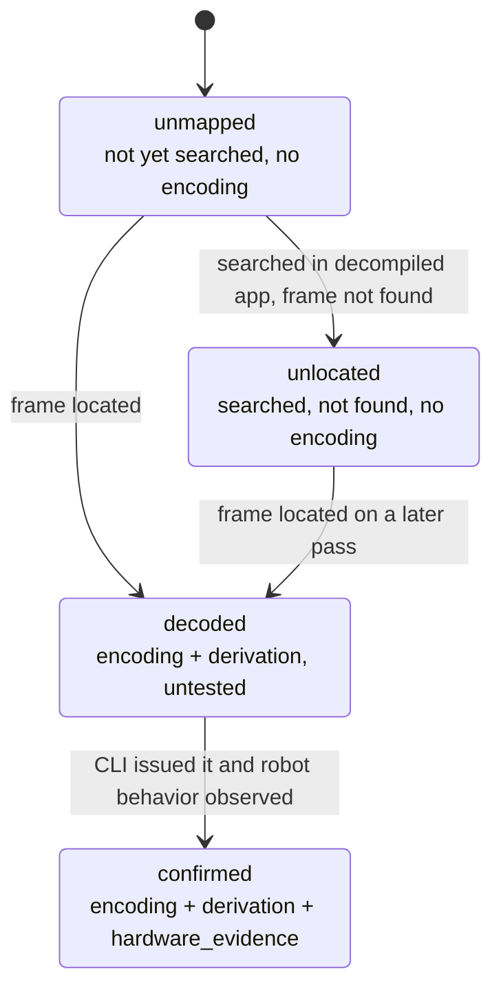
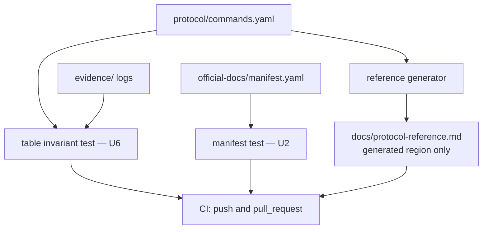

# Ruko 1088 BLE Protocol Reference - Plan

## Goal Capsule

- **Objective:** Publish a verified BLE protocol reference for the Ruko 1088 robot, discovered by decompiling the official Carle Android app and confirmed against the hardware, with a cross-platform CLI that proves each documented command works.
- **This plan's executable scope:** The hardware-independent foundation only — repository, license, vendor archive, command-table structure, generated reference, CLI transport, method documentation, and the evidence invariant that guards every later entry. No byte-level protocol content.
- **Product authority:** This plan owns the protocol reference and its reference implementation. The user-facing cross-platform tool, the AI agent control plane, and the wider hacking repo are not active scope — they are destinations that constrain design choices here.
- **Authority hierarchy:** R-IDs win on product behavior. KTD-IDs win on implementation mechanism within their cited R constraints. Units override neither.
- **Stop conditions:** Stop and report rather than proceeding if any unit would require a real service UUID, characteristic UUID, command opcode, or frame encoding in `protocol/commands.yaml`, or would record a source URL or retrieval date that was not actually observed. Synthetic values inside U6's deliberately malformed test fixtures are exempt; they never enter `protocol/commands.yaml`.
- **Execution profile:** Near-greenfield. No code, tests, or toolchain exist. One pre-existing untracked artifact is present — `official-docs/User-Manual.pdf` — which U2 must reconcile rather than assume.
- **Tail ownership:** The calling pipeline owns commit, push, and PR. The repository's own CI workflow is a deliverable of this plan, per KTD3.
- **Open blockers:** None.

**Product Contract preservation:** Requirements R1–R12, Key Decisions KD1–KD5, Actors, Flows, and Acceptance Examples are unchanged in meaning and ID. Scope Boundaries gained a `Deferred to Follow-Up Work` subsection recording plan-local sequencing.

---

## Product Contract

### Summary

A public, reproducible protocol reference for the Ruko 1088's Bluetooth control channel, plus a cross-platform CLI that grows one command at a time as the proof that each documented frame is correct. The reference is designed so that a later program can drive movement and audio at the same time without further reverse engineering.

### Problem Frame

The Ruko 1088 is controlled through three channels the vendor keeps separate: a 2.4 GHz remote, a Bluetooth LE link used by the Carle mobile app, and a Bluetooth audio sink that appears in ordinary system Bluetooth settings. Owners get whatever the app exposes and nothing else, on the two platforms the app ships for.

Nothing published describes how any of this works. The Carle app is built by iHunuo, a whitelabel publisher whose other apps drive unrelated hardware, which suggests a shared control stack behind several consumer products — and no reverse engineering of it exists in the open. An owner who wants to script the robot, drive it from a desktop, or combine motion with audio has no starting point and no way to check anyone else's work.

The cost is not a blocked task. It is that a capable, cheap, widely-sold piece of hardware is a black box to everyone who owns one.

### Key Decisions

- KD1. **The protocol reference is the deliverable; the CLI is its proof.** Chosen over building toward a demo first, which yields a reference thorough only where the demo happened to go. Governs R7, R8.
- KD2. **Discovery is static-first: decompile the app, then confirm on hardware.** The Android HCI snoop log verifies decoded frames rather than serving as the source of discovery, because a decompiled command builder gives structure that packet captures only imply. Governs R1, R2, R3.
- KD3. **The cross-platform user tool and the AI agent control plane are destinations, not deliverables.** The reference is shaped so both are cheap to build afterward. Governs R6.
- KD4. **The repo is an interoperability reference and carries no security framing.** It documents how to talk to the robot, not what unauthenticated control implies. Governs R12.
- KD5. **The scope of the reference — one robot or the iHunuo family — is gated on the decompile.** Committing before looking is a bet; the evidence costs roughly an hour of work.

<!-- ce-section: work-relationships -->
### How This Work Fits Together

This plan owns the **protocol reference and its validating CLI**. The breakdown below is the current understanding of the surrounding repo, not a committed roadmap; a later plan may revise, split, merge, or discard any of it.

- **Cross-platform user-facing control tool** — a polished tool for owners who want to drive the robot without reading a spec.
  - Depends on the command table and frame format produced here.
  - Shares the CLI as its likely starting point.
- **AI agent control plane** — a command and audio surface an agent drives, combining motion with speech.
  - Depends on this plan's reference, specifically R6.
  - Still to decide: whether it wraps the CLI or consumes the protocol directly.
- **Features the Carle app does not offer** — arbitrary command sequences, concurrent motion and audio, reactive behavior.
  - Enabled by this plan; none are built here.
  - Can proceed independently of the user-facing tool.
- **The wider hacking repo** — teardown notes, the 2.4 GHz remote, firmware, and other non-BLE material.
  - Shares the `official-docs/` archive convention established in R9.
  - Can proceed independently of everything above.

### Actors

- A1. **Maintainer** — reverse-engineers the protocol, verifies commands on hardware, writes and publishes the reference.
- A2. **1088 owner** — reads the reference and runs the CLI against their own robot.
- A3. **Downstream program** — any script, tool, or AI agent that consumes the protocol to drive the robot. Not built in this plan.
- A4. **The robot** — a BLE peripheral advertising as `JT_XXXX`, and a Bluetooth audio sink.

### Requirements

**Protocol reference**

- R1. The reference documents the BLE service and characteristic UUIDs the Carle app uses to control the robot, including which characteristic carries commands and which, if any, returns state.
- R2. The reference documents the command frame format field by field — framing, length, opcode, payload, and any checksum or terminator — with the meaning and valid range of each field.
- R3. The reference carries a command table covering the robot's full app-reachable command surface, each entry giving its byte encoding and the robot behavior it produces.
- R4. Every command table entry carries its verification state: confirmed on hardware, decoded but untested, or unmapped.
- R5. The reference documents the robot's audio channel, how it is paired, and how it relates to the BLE control channel.

**Downstream enablement**

- R6. The reference is complete enough that a program can drive movement and audio concurrently without further reverse engineering.

**Reference implementation**

- R7. A cross-platform CLI can connect to the robot and issue any command in the command table, running on macOS, Linux, and Windows.
- R8. A command counts as documented only after the CLI has issued it and the resulting robot behavior has been observed.

**Repository and publication**

- R9. Vendor-official material is archived under `official-docs/`, each item carrying its source URL and retrieval date.
- R10. The repository is public and carries a license.
- R11. The reference documents how each finding was obtained, so a reader with the same hardware can reproduce it.
- R12. The reference stays an interoperability document and contains no security advisory content.

### Key Flows

- F1. Decode and confirm a command
  - **Trigger:** The maintainer identifies an app capability with no entry in the command table.
  - **Actors:** A1, A4
  - **Steps:** Locate the capability's handler in the decompiled app; derive the frame; issue it through the CLI; observe the robot; record the encoding and the observed behavior.
  - **Outcome:** The command table gains an entry marked confirmed on hardware.
  - **Covers R3, R4, R8**

- F2. An owner reproduces a command
  - **Trigger:** A 1088 owner wants to control their robot from a computer.
  - **Actors:** A2, A4
  - **Steps:** Read the reference; install the CLI; connect to the robot; issue a command from the table.
  - **Outcome:** The robot behaves as the reference says it will.
  - **Covers R7, R10, R11**

### Acceptance Examples

- AE1. **Covers R4, R8.** Given a command decoded from the app but never run against the robot, when it is added to the reference, then it is marked decoded-but-untested and does not count as documented.
- AE2. **Covers R3, R4.** Given the app exposes a capability whose frame cannot be located in the decompiled source, when the reference is published, then that capability appears in the command table marked unmapped rather than being left out.
- AE3. **Covers R5, R6.** Given a program issues movement commands over the control channel while audio is playing to the robot, when both channels are active at once, then movement continues and audio is uninterrupted.
- AE4. **Covers R9.** Given a vendor document is archived, when it lands in `official-docs/`, then it carries its source URL and the date it was retrieved.

### Success Criteria

- A 1088 owner with no reverse-engineering experience can go from the repository to a moving robot.
- Every entry in the command table is either confirmed on hardware or visibly marked otherwise; the reference contains no silent guesses.
- A downstream program can drive motion and speech together using the reference alone.

### Scope Boundaries

**Deferred for later**

- The polished cross-platform user-facing tool, beyond the CLI that validates the reference.
- The AI agent control plane as a built artifact.
- Capabilities the Carle app lacks, beyond those that fall out of the reference itself.
- Structure for the wider hacking repo beyond the `official-docs/` convention.

**Outside this effort**

- The 2.4 GHz remote protocol. It is a separate radio with no shared surface, and decoding it is its own project.
- Firmware extraction, hardware teardown, and physical debug interfaces.
- Security advisory content, per KD4.

**Deferred to Follow-Up Work**

Plan-local sequencing. These requirements are unchanged and remain in scope for the effort; they are not executable in the current environment because the APK, a decompiler, `adb`, and the robot are all absent.

- R1, R2, R5 — require the decompiled Carle app. This plan writes their section skeletons and no content.
- R6, R8 — require the physical robot.
- AE3 — deferred with R5 and R6; it can only be demonstrated against the robot.
- The command-encoding half of R7 — requires both. This plan builds the CLI's transport only; no command dispatch and no `send` subcommand are implemented.

The Success Criteria above describe the finished effort, not this slice. All three depend on deferred work.

### Dependencies / Assumptions

- **Assumption — the audio channel is independent of BLE control.** The robot is understood to expose a Classic Bluetooth audio sink separate from its BLE control link. The source is a marketplace listing, not vendor documentation. R6 and AE3 rest on this; confirm it in the first hardware session.
- **Assumption — the BLE control channel is unauthenticated and unencrypted,** as is typical for this class of module. Unverified.
- **Assumption — the Carle APK is not meaningfully obfuscated.** Unverified until the decompile. If it is, KD2's static-first ordering inverts and the snoop log becomes the primary discovery surface, which also makes the `derivation` field in KTD9 unsatisfiable in its current form.
- **Dependency — hardware access:** the robot itself, an Android device running Carle, and an iOS device.
- **Dependency — the app binary:** the vendor's own distribution host refused connections during research, so the APK is pulled from the Android device rather than downloaded.
- **Dependency — network reachability for U2.** `rukotoy.com` responded during research; `d.ihunuo.com` and `ihunuo.com` did not. U2 must handle a source that cannot be retrieved.

### Outstanding Questions

**Deferred to Planning**

- Does `com.ihunuo.jtlrobot` share a BLE protocol layer with other iHunuo apps? If it does, the reference may be better scoped to the framework with the 1088 as its first profile. Answered by the decompile, per KD5.
- Is the audio channel Classic A2DP, and can it be held open while BLE commands are being written?
- Which commands the app can issue that the 2.4 GHz remote cannot, and whether the two channels share an encoding.
- Does the iOS Carle app run natively on Apple Silicon? If so it provides a known-good controller on the development machine for comparing behavior.
- Does the vendor's "200 programmable commands by app" figure describe distinct protocol commands or a user-composed sequence capacity? U3 records the working interpretation; the decompile settles it.

None of these block the units in this plan. Each is answered by evidence the deferred hardware work produces.

### Sources / Research

- Android package `com.ihunuo.jtlrobot` — the Carle app on Google Play, listed by Ruko as the controller for 1088 Blue, Green, Gold, and Pink.
- `com.ihunuo.ykr_hn_2005a_tlw66` — a ThermoPro thermometer app from the same publisher. Evidence that iHunuo is a whitelabel app house with a codebase family spanning unrelated hardware.
- Ruko's download center delegates both iOS and Android downloads to `d.ihunuo.com/app/psss`. That host refused connections during research from the US.
- The 1088 manual gives the BLE advertising name as `JT_XXXX` and requires Android 4.3 or iOS 8.0.
- Vendor specifications: 3.7 V 600 mAh battery, 9 motor drives, 2.4 GHz remote at 65 ft, 50 programmable commands by remote and 200 by app, 14 voice commands, 10 songs, 8 dances, 2 gymnastic routines, 4 stories.
- No published reverse engineering of any iHunuo BLE protocol was found.
- All four 1088 colors share identical published specifications; color is the only differing field.
- Bleak is the current cross-platform Python BLE client, abstracting CoreBluetooth, BlueZ, and WinRT behind one asyncio API. The 3.x line requires Python 3.10 or newer.

---

## Planning Contract

### Key Technical Decisions

- KTD1. **Python with Bleak for the CLI.** Bleak 3.x covers macOS, Linux, and Windows from one codebase, so R7's cross-platform requirement needs no per-platform transport code. Python also keeps the barrier low for the hobbyist contributors R10 targets. Pin as a compatible release, not an exact version — Bleak shipped two majors in nine months. Governs R7.
- KTD2. **The command table is a machine-readable data file; the reference document is generated from it.** A single `protocol/commands.yaml` is the one owner of every entry and its verification state, which makes R4 checkable by a test instead of by discipline. Governs R3, R4.
- KTD3. **An automated invariant test enforces the evidence rule, and repository CI runs it on every push and pull request.** A gate nobody runs is the convention it was meant to replace, and a public repo taking outside contributions needs the check to fire before a merge rather than after. Governs R4, R8.
- KTD4. **The table is seeded from the vendor-documented capability surface, and that seeding is labeled as approximate.** Ruko publishes capability counts, which become rows with no encoding — real coverage of what is known, not a claim that the row set is complete or one-to-one with protocol commands. Rejected alternative: ship the schema against an empty table and seed after the decompile, which avoids id churn but leaves the deferred work without a checklist. Governs R3.
- KTD5. **Device identity is recorded per-platform.** macOS CoreBluetooth exposes a system-assigned UUID rather than a Bluetooth MAC, so a single identifier field would be wrong on one of the three target platforms. The identity formatter takes the platform as an injectable parameter so all three renderings are testable from one machine. Governs R7.
- KTD6. **Toolchain: `uv` for environment and dependencies, `pytest` for tests, `ruff` for lint, PyYAML for parsing.** Greenfield repo with no existing convention; these are the current mainstream Python defaults. PyYAML is load-bearing, not incidental — both `commands.yaml` and `manifest.yaml` are parsed by production code and tests.
- KTD7. **MIT license.** Permissive and conventional for a protocol reference whose value is being copied into other people's tools. Satisfies R10.
- KTD8. **This plan executes only the hardware-independent slice; R1, R2, R5, R6, R8 and command dispatch are deferred.** (session-settled: user-directed — chosen over executing the full Product Contract: with no APK, decompiler, or robot reachable, completing those requirements would mean fabricating UUIDs and command frames in a public repo.) Governs R3, R4, R7.
- KTD9. **Evidence is structured and resolvable, and derivation is separate from hardware observation.** A `confirmed` row carries `hardware_evidence` naming a date, a platform, and a repo-relative log path that must exist on disk — a presence check on a free-text field would let `evidence: "tested it"` pass the honesty gate. A `decoded` row carries `derivation` recording where in the decompiled app the frame came from, which is what R11 requires and what a hardware-only evidence field cannot express. Governs R4, R8, R11.
- KTD10. **Four states, not three: `unmapped`, `unlocated`, `decoded`, `confirmed`.** `unmapped` means not yet searched; `unlocated` means searched in the decompiled app and not found. Collapsing them makes AE2 unverifiable, because a capability nobody looked for is indistinguishable from one that was hunted and missed. Governs R4.
- KTD11. **A row's `provenance` records whether it came from vendor marketing or the decompile, and a marketing-provenance row can never carry an encoding.** This keeps KTD4's approximation honest at row granularity and gives the id-stability rule something to enforce: a marketing id is retired with `superseded_by`, never silently repurposed when the decompile splits or merges it. Governs R3, R4.

### High-Level Technical Design

Every command entry moves through four states. The state is data, not prose, and the transition rules are what KTD3's test enforces.



This plan populates only the `unmapped` state. Every transition belongs to the deferred hardware work, though U4 and U6 must render and validate all four so the deferred work inherits a working mechanism.

The data file is the single source; the published reference and the invariant test both read from it, and CI runs the gates.



### Assumptions

Resolved without user input during a pipeline run. Each is cheap to change before the repo has contributors.

- Python 3.10 or newer, matching Bleak 3.x's declared floor.
- The repository stays a single package rather than a workspace; there is one deliverable CLI.
- The vendor's "200 programmable commands by app" figure describes user-composed sequence slots rather than distinct protocol opcodes. U3 records this as an unconfirmed working interpretation rather than treating it as a missing 160 rows.

### Risks & Dependencies

- **macOS gates Bluetooth behind a permission prompt.** On macOS 12 and later the process running `carle scan` — the terminal, not the package — must be granted Bluetooth access, and a denied prompt surfaces as an empty scan rather than an error. U5 must name this in its empty-scan diagnostic and `README.md` must cover it, or the first thing every macOS user experiences is a silent no-op.
- **A faked Bleak client can drift from real Bleak behavior.** U5's tests prove the CLI's logic, not that Bleak is driven correctly. The first hardware session is the real integration test for transport, and it may find transport bugs the suite passed over.
- **The seeded capability surface comes from vendor marketing copy.** Rows may merge or split once the decompile lands. KTD11's `provenance` and `superseded_by` fields contain the damage; they do not eliminate the churn.
- **`official-docs/User-Manual.pdf` exists in the working tree with no recorded provenance.** U2 must reconcile it. Back-filling a guessed source URL or retrieval date is a stop condition, not a fallback.

### Sequencing

U1 gates every unit, because it creates `pyproject.toml` and every other unit's verification runs through `uv`. U2 and U5 are then independent of each other and of the data-file work. U3 gates U4 and U6, and owns `src/carle/table.py` so both consumers depend on U3 alone.

---

## Output Structure

```text
.
├── .github/
│   └── workflows/
│       └── ci.yml
├── .gitignore
├── LICENSE
├── README.md
├── CONTRIBUTING.md
├── pyproject.toml
├── docs/
│   ├── protocol-reference.md      # generated command table + hand-written prose
│   └── method.md                  # how findings are obtained and reproduced
├── evidence/                      # hardware observation logs; empty in this slice
├── official-docs/
│   ├── manifest.yaml              # source URL + retrieval date per item
│   └── <archived vendor files>
├── protocol/
│   └── commands.yaml              # the one owner of every command entry
├── scripts/
│   └── generate_reference.py
├── src/
│   └── carle/
│       ├── __init__.py
│       ├── cli.py                 # scan / connect / info
│       ├── table.py               # loads and validates commands.yaml
│       └── transport.py           # Bleak wrapper
└── tests/
    ├── fixtures/
    │   └── seeded_ids.txt
    ├── test_cli.py
    ├── test_manifest.py
    ├── test_reference_generation.py
    └── test_table_invariants.py
```

The per-unit `**Files:**` lists remain authoritative. The implementer may adjust this layout if implementation reveals a better one.

---

## Implementation Units

### U1. Repository foundation, toolchain, and CI

- **Goal:** Make the repository publishable and give every later unit a working test environment and an enforced gate.
- **Requirements:** R10, R12
- **Dependencies:** None
- **Files:** `README.md`, `LICENSE`, `CONTRIBUTING.md`, `.gitignore`, `pyproject.toml`, `.github/workflows/ci.yml`
- **Approach:**
  1. `LICENSE` is MIT per KTD7.
  2. `pyproject.toml` declares the package, the `carle` console entry point, PyYAML, and the pytest and ruff dev dependencies per KTD6. Bleak is added by U5. This lands in U1 because every other unit's verification runs `uv run pytest`.
  3. `README.md` states what the project is and what is not yet known. It carries a Status section naming the deferred work and what unblocks it, and a Quickstart covering install, `carle scan`, and the macOS Bluetooth permission prompt. It must not imply the protocol is documented when the table has no encodings.
  4. `CONTRIBUTING.md` states two rules: the evidence rule KTD3 enforces, and the interoperability-only rule per KD4 and R12, with one example of each side of that line.
  5. `.github/workflows/ci.yml` runs `uv run pytest` and `uv run ruff check .` on push and pull request, across an ubuntu, macos, and windows matrix.
  6. Extend `.gitignore` for Python artifacts and any pulled APK, so a contributor's binary never lands in the repo.
- **Patterns to follow:** None in repo; greenfield.
- **Test scenarios:** Test expectation: none — configuration and documentation only, no behavior. The workflow is exercised by CI itself.
- **Verification:** `uv run pytest` executes (collecting zero tests is a pass at this point). `LICENSE` names MIT. `README.md` carries Status and Quickstart and claims no documented commands.

### U2. Vendor document archive and manifest

- **Goal:** Populate `official-docs/` with vendor-official material, each item carrying provenance, and reconcile the file already sitting there.
- **Requirements:** R9, and AE4
- **Dependencies:** U1
- **Files:** `official-docs/manifest.yaml`, `official-docs/*` (archived items), `tests/test_manifest.py`
- **Approach:**
  1. Record provenance for the pre-existing `official-docs/User-Manual.pdf`. It is the first-party Ruko Carle User Manual v2.0, obtained from Ruko's download center (`rukotoy.com/download-center`) on 2026-08-11. Pin the exact product or app page it is served from — the 1088 product pages and the Carle app page both resolve — and record that URL with the 2026-08-11 retrieval date. If the exact page cannot be pinned, record the download-center root rather than inventing a deeper URL.
  2. Archive the vendor material in Sources / Research: the Ruko 1088 specification pages and the Carle download-center page.
  3. `manifest.yaml` carries one entry per item: `local_path` (optional), `source_url`, `retrieved`, and a short description.
  4. Where a page cannot be retrieved — `d.ihunuo.com` refused connections during research — record the entry with `source_url`, the attempt date, a `retrieval_failed` note, and what was captured instead. `local_path` is omitted for these.
- **Patterns to follow:** None in repo; greenfield.
- **Test scenarios:**
  - Covers AE4. Every manifest entry has a non-empty `source_url` and a `retrieved` date parseable as ISO 8601.
  - Every `local_path` named in the manifest exists on disk.
  - Every file in `official-docs/` other than the manifest appears in the manifest, so nothing is archived without provenance.
  - An entry with `retrieval_failed` and no `local_path` validates, while an entry with neither `local_path` nor `retrieval_failed` fails.
- **Verification:** `uv run pytest tests/test_manifest.py` passes, and `User-Manual.pdf` carries either a real source URL or an explicit unverified marker.

### U3. Command table schema, loader, and seed

- **Goal:** Create the one data file that owns every command entry, its loader, and a seed whose coverage is real and whose encodings are empty.
- **Requirements:** R3, R4
- **Dependencies:** U1
- **Files:** `protocol/commands.yaml`, `src/carle/table.py`, `tests/fixtures/seeded_ids.txt`
- **Approach:**
  1. Define the entry schema: `id`, `capability`, `provenance` (`vendor-marketing` or `decompile`), `status` (`unmapped`, `unlocated`, `decoded`, `confirmed`), and the optional `encoding`, `derivation`, `observed_behavior`, `hardware_evidence`, and `superseded_by`. An absent optional field means the key is absent, not present-and-null.
  2. `src/carle/table.py` loads and validates the file against that schema. It lives here, not in U4, because U4 and U6 both consume it and U3 owns the schema.
  3. Seed rows from the vendor-published capability counts per KTD4 — the movement axes, 10 songs, 8 dances, 2 gymnastic routines, 4 stories, and 14 voice commands. Do not seed articulation rows; the vendor publishes only "9 motor drives", which is not a capability enumeration.
  4. Every seeded row is `provenance: vendor-marketing`, `status: unmapped`, with no `encoding`.
  5. Record a top-level `coverage_note` stating which vendor figures were seeded and the working interpretation of the "200 programmable commands by app" figure, flagged unconfirmed.
  6. Write every seeded id to `tests/fixtures/seeded_ids.txt` so U6 can detect silent deletions.
- **Execution note:** The temptation here is to fill in plausible opcodes. Every row ships without one; the file's value is that its emptiness is honest and machine-checkable.
- **Patterns to follow:** None in repo; greenfield.
- **Test scenarios:** Covered by U6's invariant suite, which cannot be written until this schema exists.
- **Verification:** `protocol/commands.yaml` parses through `src/carle/table.py`, and every row is `vendor-marketing` / `unmapped` with no `encoding`.

### U4. Generated protocol reference document

- **Goal:** Publish the reference with its command table generated from `protocol/commands.yaml`, and hand-written skeletons for the structural content the decompile will fill.
- **Requirements:** R3, R4, R11. R1, R2, R5 receive placeholder sections only; the requirements themselves are deferred per KTD8.
- **Dependencies:** U3
- **Files:** `docs/protocol-reference.md`, `scripts/generate_reference.py`, `tests/test_reference_generation.py`
- **Approach:**
  1. `scripts/generate_reference.py` renders the command table into a delimited region of `docs/protocol-reference.md`, so hand-written prose around it survives regeneration. It renders all four states, since the deferred work inherits this generator.
  2. The generator accepts `--check`: it regenerates into memory, compares against the delimited region on disk, prints a diff and exits non-zero on drift, and ignores content outside the delimiters.
  3. Hand-write the section skeleton for R1, R2, and R5 — service and characteristic UUIDs, frame format, audio channel — each stating plainly that it is unmapped pending the decompile. An empty heading is acceptable; a speculative one is not.
  4. The generated region carries the `coverage_note` from U3, so the published table states its own approximation rather than implying completeness.
- **Patterns to follow:** None in repo; greenfield.
- **Test scenarios:**
  - Regenerating against an unchanged `commands.yaml` produces a byte-identical file.
  - Hand-written prose outside the delimited region survives regeneration unchanged.
  - The generated table renders one row per entry, with the status column populated for every row.
  - A fixture row with `status: confirmed` renders its `observed_behavior`; an `unmapped` row renders no encoding content.
  - `--check` exits non-zero when `commands.yaml` changed without regeneration, and zero when it did not.
  - The hand-written regions contain no hex-byte literals and no per-capability verification words, so every encoding and verification claim lives inside the generated region.
- **Verification:** `uv run pytest tests/test_reference_generation.py` passes, and `docs/protocol-reference.md` shows every capability as unmapped.

### U5. CLI scaffolding and BLE transport

- **Goal:** Ship a cross-platform CLI that scans for the robot, connects, and reports what the peripheral exposes.
- **Requirements:** R7 (transport only; command dispatch is deferred)
- **Dependencies:** U1
- **Files:** `src/carle/__init__.py`, `src/carle/cli.py`, `src/carle/transport.py`, `tests/test_cli.py`, `pyproject.toml` (add the Bleak dependency)
- **Approach:**
  1. `transport.py` wraps Bleak's scan and connect: scanning for peripherals advertising a `JT_` prefix, connecting to one, and enumerating its GATT services and characteristics.
  2. `cli.py` provides `scan`, `connect`, and `info`. `info` prints discovered service and characteristic UUIDs verbatim — it supplies R1's raw material in the later hardware session, so it must not interpret them.
  3. An empty scan exits zero and prints a diagnostic naming both the expected `JT_` prefix and the macOS Bluetooth permission prompt. Non-zero exits are reserved for genuine transport errors, because an empty scan is the normal result on a machine with no robot and is indistinguishable from a denied permission at the Bleak layer.
  4. The identity formatter takes the platform as an injectable parameter defaulting to `sys.platform`, per KTD5, so all three renderings are testable from one machine.
  5. No `send` subcommand. Command dispatch has nothing to dispatch and is deferred with the rest of R7.
- **Execution note:** No robot is reachable, so transport behavior is proven against a faked Bleak client. Keep the Bleak boundary narrow enough that faking it is straightforward.
- **Patterns to follow:** None in repo; greenfield.
- **Test scenarios:**
  - `scan` against a faked adapter returning peripherals named `JT_1234` and `Other` lists only the `JT_` device.
  - `scan` against a faked adapter returning no peripherals exits zero and prints a diagnostic naming the `JT_` prefix and the macOS permission prompt.
  - `connect` against a faked adapter that raises a connection timeout reports the failure and exits non-zero.
  - `info` against a faked connected peripheral prints every discovered service and characteristic UUID verbatim.
  - Identity rendering produces a labeled system UUID for a macOS platform value, and a labeled address for Linux and Windows platform values, all from one machine.
- **Verification:** `uv run pytest tests/test_cli.py` passes, and `carle scan` on the development machine with no robot present exits zero with the diagnostic rather than a traceback.

### U6. Evidence invariant test suite

- **Goal:** Make the evidence rule mechanical, so no future entry can claim verification it does not have or disappear without trace.
- **Requirements:** R4, and AE1, AE2. R8 itself is deferred; this unit builds its guard.
- **Dependencies:** U3
- **Files:** `tests/test_table_invariants.py`
- **Approach:**
  1. Assert the schema for every row via `src/carle/table.py`.
  2. Enforce the KTD10 state rules: `unmapped` and `unlocated` carry no `encoding`, `derivation`, or `hardware_evidence`; `decoded` carries `encoding` and `derivation` and no `hardware_evidence`; `confirmed` carries all of `encoding`, `derivation`, `observed_behavior`, and `hardware_evidence`.
  3. Enforce KTD9 resolvability: a `hardware_evidence` entry names a `date` that parses, a `platform`, and a `log` path that exists on disk.
  4. Enforce KTD11: a `provenance: vendor-marketing` row cannot carry an `encoding`.
  5. Assert ids are unique, and that every id in `tests/fixtures/seeded_ids.txt` is still present unless it carries `superseded_by` naming its replacements.
  6. Assert the seeded capability counts — 10 songs, 8 dances, 2 gymnastic routines, 4 stories, 14 voice commands — so a dropped row fails rather than shrinking the table silently.
- **Execution note:** These tests are the deliverable, not scaffolding for it. Write them to fail loudly against deliberately malformed fixtures before trusting them.
- **Patterns to follow:** None in repo; greenfield.
- **Test scenarios:**
  - Covers AE1. A fixture row with `status: confirmed` and no `hardware_evidence` fails.
  - Covers AE1. A fixture row with `status: decoded` and a `hardware_evidence` entry fails.
  - A fixture row whose `hardware_evidence.log` points at a nonexistent path fails.
  - A fixture row with `status: unmapped` and an `encoding` fails.
  - A fixture row with `provenance: vendor-marketing` and an `encoding` fails.
  - Covers AE2. A fixture missing a seeded id, with no `superseded_by` on that id, fails.
  - Covers AE2. A fixture whose song rows number nine instead of ten fails.
  - A fixture with two rows sharing an id fails.
  - The real `protocol/commands.yaml` passes every invariant.
- **Verification:** `uv run pytest tests/test_table_invariants.py` passes, and each malformed fixture fails for its own distinct reason rather than a shared parse error.

### U7. Method and reproducibility documentation

- **Goal:** Document how findings are obtained, so a reader with the same hardware can reproduce them and the deferred work has a written starting point.
- **Requirements:** R11, R12
- **Dependencies:** U1
- **Files:** `docs/method.md`
- **Approach:**
  1. Document the static-first path per KD2: install Carle from Play, locate the package with `adb shell pm path com.ihunuo.jtlrobot`, pull it, and decompile it. Record why the vendor's own download host is not used.
  2. Document the verification path: enabling the Android HCI snoop log, pulling the capture, and reading it alongside a decoded frame.
  3. Document how a contributor records a hardware observation that promotes an entry to `confirmed`, including where the log file goes and what the `hardware_evidence` fields mean.
  4. Keep the framing interoperability-only per KD4 and R12.
- **Patterns to follow:** None in repo; greenfield.
- **Test scenarios:** Test expectation: none — documentation only, no behavior.
- **Verification:** `docs/method.md` names the package `com.ihunuo.jtlrobot`, describes both the static and capture paths and the evidence-recording procedure, and contains no security advisory content.

---

## Verification Contract

| Gate | Command | Applies to | Signal |
|---|---|---|---|
| Unit tests | `uv run pytest` | U2, U4, U5, U6 | All tests pass |
| Lint | `uv run ruff check .` | All units | No findings |
| Format | `uv run ruff format --check .` | All units | No diff |
| Reference is current | `uv run python scripts/generate_reference.py --check` | U4 | Exits zero; generated region matches `commands.yaml` |
| Honesty gate | `uv run pytest tests/test_table_invariants.py` | U3, U6 | No entry claims unearned verification, and no seeded row vanished |
| CI matrix | `.github/workflows/ci.yml` on push and pull request | All units | Green on ubuntu, macos, windows |

The honesty gate is the one that matters most, and KTD3 is why it runs in CI rather than on request. It is the difference between a reference people can trust and a plausible-looking document.

---

## Definition of Done

**Global**

- `uv run pytest` and `uv run ruff check .` pass from a clean checkout, and the CI workflow is green on all three platforms.
- `protocol/commands.yaml` carries the seeded vendor capability counts, and every row is `vendor-marketing` / `unmapped` with no encoding.
- `docs/protocol-reference.md` states plainly that UUIDs, frame format, and audio channel are unmapped, and carries the coverage note. It contains no speculative protocol content.
- `official-docs/` carries archived vendor material, every file is accounted for in `manifest.yaml`, and `User-Manual.pdf` has real provenance or an explicit unverified marker.
- `carle scan` runs on the development machine with no robot present, exiting zero with its diagnostic.
- The README Quickstart has been walked end to end from a clean checkout.
- No dead-end or experimental code remains in the diff.

**Per unit**

- U1 — `LICENSE` is MIT; `CONTRIBUTING.md` states both the evidence rule and the interoperability-only rule; CI workflow exists.
- U2 — every archived file has a manifest entry, and no provenance was invented.
- U3 — `commands.yaml` parses through `table.py` and every row is unmapped.
- U4 — the reference regenerates deterministically, `--check` detects drift, and hand-written regions carry no encodings or verification claims.
- U5 — `scan`, `connect`, and `info` work against a faked adapter; no `send` subcommand exists.
- U6 — each malformed fixture fails for its own distinct reason.
- U7 — `docs/method.md` covers the static path, the capture path, and evidence recording.
