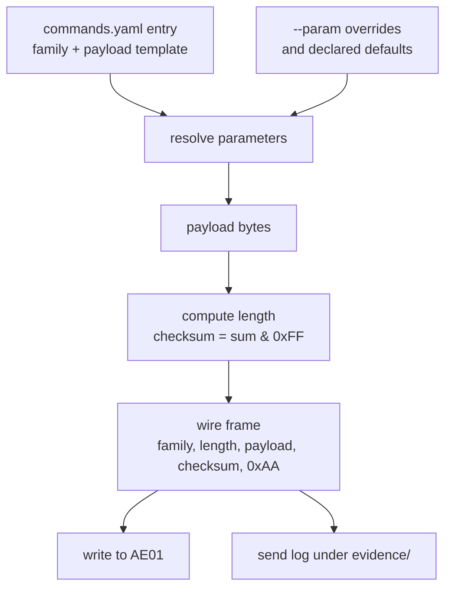

# CLI Write Path and Hardware Confirmation - Plan

## Goal Capsule

- **Objective:** Let the CLI issue a documented frame to the robot, and let an observed response promote a table entry from `decoded` to `confirmed` on evidence the tool wrote rather than a claim a contributor typed.
- **Product authority:** The Product Contract lives in the origin plan (`docs/plans/2026-08-11-001-feat-ruko-1088-ble-protocol-plan.md`) and its R-IDs are shared. This plan implements the deferred command-dispatch half of R7 and R8's *enforcement mechanism*, and changes how R3 and R4 are stored. R8's hardware half completes on the first real session.
- **Authority hierarchy:** R-IDs win on product behavior. KTD-IDs win on implementation mechanism within their cited R constraints. Units override neither.
- **Stop conditions:** Stop and report rather than proceeding if a unit would let a row reach `confirmed` without a send log the *invariant suite* accepts, or would record protocol bytes or parameter ranges not derived from the decompiled app.
- **Execution profile:** Brownfield. Every unit modifies existing code, and U1 migrates data the published reference is generated from.
- **Tail ownership:** The calling session owns commit, push, and PR. CI already exists.
- **Open blockers:** None. Two hardware questions are deferred, not blocking.

---

## Product Contract

### Summary

`carle send` builds a frame from the command table and writes it to the robot's control characteristic, recording what it sent to a log under `evidence/`. `carle confirm` reads that log and promotes the entry, closing the decoded-to-confirmed loop the honesty gate was built around.

### Problem Frame

The command table now holds six real frames derived from the decompiled app, and no way to send any of them. `docs/method.md` tells a contributor that a command is not documented until they issued it and watched the robot respond — and then offers no command that issues anything. The gate is fully built and has nothing to admit.

The stored encodings are also the wrong shape for a builder to use. They are free-text strings carrying the whole wire frame, including a length, a checksum, and a terminator that are all mechanically derivable from the payload. Parameterized commands are written with angle-bracket placeholders that no code can parse.

### Requirements

Carried from the origin plan; R-IDs are shared with it.

- R3. The reference carries a command table covering the robot's full app-reachable command surface, each entry giving its byte encoding and the robot behavior it produces.
- R4. Every command table entry carries its verification state: confirmed on hardware, decoded but untested, or unmapped.
- R7. A cross-platform CLI can connect to the robot and issue any command in the command table, running on macOS, Linux, and Windows. *This plan implements the command-dispatch half deferred by the origin.*
- R8. A command counts as documented only after the CLI has issued it and the resulting robot behavior has been observed.
- R11. The reference documents how each finding was obtained, so a reader with the same hardware can reproduce it.

### Acceptance Examples

- AE5. **Covers R7, R8.** Given a `decoded` entry, when the user runs `carle send` against a real robot and then `carle confirm` with a description of what happened, then the entry becomes `confirmed` with `hardware_evidence` naming the log the send produced.
- AE6. **Covers R8.** Given no send log exists for an entry, when the user runs `carle confirm`, then it refuses and the entry stays `decoded`.
- AE7. **Covers R8.** Given a send log whose frame no longer matches the entry's current encoding, when the user runs `carle confirm`, then it refuses — the observation described a different frame.
- AE8. **Covers R7.** Given an entry with no `family` and `payload`, when the user runs `carle send` for it, then it refuses and explains that its frame is unknown.
- AE9. **Covers R4, R8.** Given a hand-edited `confirmed` entry citing a log that is a dry run, is raw, names a different entry, or records a different frame, when the invariant suite runs, then it fails — the gate does not depend on anyone having run `carle confirm`.

### Scope Boundaries

**Deferred to Follow-Up Work**

- Decoding the gyro (`0xB5`) and programmed-sequence (`0xB2`) families. This plan ships the mechanism, not more coverage.
- Any GUI, and the AI agent control plane. Both still wait on a fuller command table.
- Documenting what the notify characteristic reports. Sends will start capturing it, but interpreting it needs data this plan only begins to collect.
- AE5's hardware half — an actual send to a robot promoting a real row. This plan ships and tests the mechanism against a fake backend and a manufactured log; the first hardware session completes AE5.

**Outside this effort**

- Security framing, per the origin's KD4.

### Dependencies / Assumptions

- **Assumption — the envelope is invariant across all four families.** Every send site in the decompiled app builds the same `[family][length][payload][checksum][terminator]` shape. KTD1 rests on this. If a family turns out to differ, the builder gains a per-family variant rather than the table reverting to stored whole frames.
- **Assumption — the control characteristic accepts write-without-response.** The app uses it exclusively (`Peripheral.write(..., false)`).
- **Dependency — a physical robot and Bluetooth permission** for any `confirm`. Everything else, including `send --dry-run`, works without hardware.

### Outstanding Questions

**Deferred to Planning**

- Does the second payload byte of a media command select an individual track? The app always sends `0`. U1 expresses this directly as a parameter with a default of 0, so the experiment is one `--param` away.
- What does the notify characteristic report? U3 captures whatever arrives into the send log; interpreting it comes later.
- What are the three unexplained bytes in the movement payload? They are declared as parameters defaulting to 0 rather than guessed at.

---

## Planning Contract

### Key Technical Decisions

- KTD1. **The table stores family and payload; the builder computes length, checksum, and terminator.** Those three are mechanically derivable, and storing them lets a contributor edit a payload, forget the checksum, and publish a frame that cannot work. The cost is that a fabricated frame now always checksums correctly, which KTD10 answers. Governs R3, R4.
- KTD2. **Payload bytes are a template with declared parameters.** A byte is either a literal or a `{name}` reference resolved from a `parameters` block giving range and default. This makes a parameterized command machine-buildable, and lets an open question be expressed as data rather than prose. Governs R7.
- KTD3. **`carle send` writes the evidence; `carle confirm` reads it.** Two commands rather than a flag. The log records the exact bytes, the resolved parameters, the timestamp, the platform, the write result, and any notification — none of which a contributor should be retyping. Governs R8, R11.
- KTD4. **`confirm` requires a matching send log and refuses without one.** (session-settled: user-approved — chosen over accepting a hand-written observation: a tool-written log is evidence, a typed claim is an assertion.) The cost is real: a command observed working through the phone app cannot be confirmed. Governs R8.
- KTD5. **`send` refuses any entry without a `family` and `payload`, and `--raw` is the only path to arbitrary bytes.** Raw sends log to a scratch directory, never to `evidence/`, so the exploration escape hatch cannot enter the evidence chain at all. Governs R7, R8.
- KTD6. **Writes use write-without-response, matching the app.** `write_gatt_char(..., response=False)`. Requesting a response could change timing or fail outright on a characteristic that does not support it. Note the consequence for KTD11: a successful write means the host's stack accepted the bytes, not that the robot received them. Governs R7.
- KTD7. **A send subscribes to the notify characteristic for its duration,** and the promoted entry records whether anything came back. It is nearly free, it is the only way anything will be learned about a characteristic currently documented as unknown, and it is the one signal in the chain the contributor did not author. Governs R8.
- KTD8. **Writing `commands.yaml` back splits the file at the `commands:` key and re-emits everything above it verbatim.** A plain YAML round-trip drops the comment header *and* reflows `coverage_note` — it is a `|` literal block that `safe_dump` re-emits as a quoted folded scalar, a 61-line diff on every promotion. Splitting at the first top-level key is not enough, because `coverage_note` *is* that key. Chosen over a comment-preserving YAML library, a dependency for one call site. Governs R4.
- KTD9. **The invariant suite parses the cited log; `carle confirm` is convenience, not enforcement.** A path-existence check lets anyone hand-edit an entry to `confirmed` pointing at any non-empty file in `evidence/`, and every CI gate passes — the CLI's rules are enforced by a code path an attacker does not run. The gate must open the log and require that it names this entry, is a real send rather than a dry run, and records a frame equal to the entry's rebuilt frame. Governs R4, R8.
- KTD10. **`family` is constrained to the four bytes the decompile documents.** With the checksum computed, an invented opcode would render as a well-formed frame indistinguishable from a real one. A closed set means a guess at the undecoded gyro family cannot reach the published reference. Governs R3.
- KTD11. **`confirmed` is defined, in the vocabulary the reader sees, as "the CLI issued this exact frame and the contributor reported the resulting behavior."** The chain proves the bytes left the host; `observed_behavior` is an unverified human report. Stating that plainly costs nothing and is the difference between a reference that is trusted and one that deserves to be. Governs R4, R11.
- KTD12. **A promotion records the parameter values that were actually sent.** One `move_rocker` row spans a six-parameter space; observing it once at defaults says nothing about direction 5. The promoted entry carries the observed parameter set, and the reference renders it, so `confirmed` never implies more coverage than was tested. Governs R4.

### High-Level Technical Design

Frame construction. The table holds the two fields that cannot be derived; everything else is computed at send time, so the stored form and the wire form cannot drift apart.



The confirmation loop, and the gate that does not trust it. `carle confirm` is the ergonomic path; the invariant suite re-derives the same judgement from the committed files, so a hand-edited promotion fails in CI.

```mermaid
sequenceDiagram
  actor U as Contributor
  participant CLI as carle
  participant R as Robot
  participant L as evidence/
  participant G as invariant suite
  U->>CLI: send &lt;id&gt;
  CLI->>R: subscribe AE02, write frame to AE01
  R-->>CLI: notification (if any)
  CLI->>L: write send log
  U->>U: watch the robot
  U->>CLI: confirm &lt;id&gt; --behavior "..."
  CLI->>L: read most recent real-send log for &lt;id&gt;
  CLI->>CLI: frame in log matches entry rebuilt at logged parameters?
  CLI->>CLI: promote, cite the log, record observed parameters
  Note over G: later, in CI, from the committed files alone
  G->>L: parse every cited log
  G->>G: entry id, real-send marker, frame equality — all re-checked
```

### Migration

U1 rewrites the six decoded rows. The conversion is checkable rather than trusted, in two forms because two of the stored encodings are templates rather than byte literals:

- The four `media_*` rows have fully literal stored frames. Built at declared defaults, each must equal its stored `encoding` string byte-for-byte.
- `volume_set` and `move_rocker` store placeholder templates (`B3 02 04 <level> <sum> AA`). Render the new template back into placeholder form — literals as hex, each `{name}` as `<name>`, plus the computed length and a `<sum>` slot — and assert string equality against the stored value. This covers `move_rocker`'s six-slot payload, the widest transcription surface in the table.

| Entry | family | payload | parameters (range, default) |
|---|---|---|---|
| `media_gymnastics` | `0xB3` | `0x00`, `{index}` | index: 0-255 undetermined, default 0 |
| `media_story` | `0xB3` | `0x01`, `{index}` | index: 0-255 undetermined, default 0 |
| `media_dance` | `0xB3` | `0x02`, `{index}` | index: 0-255 undetermined, default 0 |
| `media_music` | `0xB3` | `0x03`, `{index}` | index: 0-255 undetermined, default 0 |
| `volume_set` | `0xB3` | `0x04`, `{level}` | level: 0-2, default 0 |
| `move_rocker` | `0xB6` | `{mode}`, `{speed}`, `{direction}`, `{p3}`, `{limb}`, `{p5}` | mode: 0-2, default 0; speed: 0-255 undetermined, default 0; direction: 0-8, default 0; p3: 0-2, default 0; limb: 0-12, default 0; p5: 0-255 undetermined, default 0 |

Every range comes from the decompiled source, and a range the source does not establish is declared `undetermined` and accepts the full byte. `direction` includes 0 because `NormolContorlActivity.sendconmmde()` writes 0 when the rocker is centred, so a defaults-only send is a valid no-movement frame. `p3` and `p5` are the two bytes whose meaning is still unknown; the app writes 1 or 2 into `p3` and never assigns `p5`.

### Sequencing

U1 and U2 land together — U1 removes a field the current invariant suite and generator both read, so the tree is red between them. U3 is independent of the data work. U4 depends on U1 and U3. U5 and U6 depend on U4. U7 depends on U2 as well as U1, U4 and U6, because U2 regenerates the document U7 hand-edits.

---

## Implementation Units

### U1. Frame builder, schema change, and migration

- **Goal:** Replace stored whole-frame strings with a family plus a payload template, and put frame construction in one place.
- **Requirements:** R3, R4; governed by KTD1, KTD2, KTD10
- **Dependencies:** None
- **Files:** `src/carle/frame.py`, `src/carle/table.py`, `protocol/commands.yaml`, `tests/test_frame.py`
- **Approach:**
  1. `frame.py` owns construction and parsing: a family byte plus resolved payload bytes produce the wire frame; parsing reverses it, which U6 and U2 both need.
  2. Extend the entry schema with `family`, `payload`, and an optional `parameters` block per KTD2. Constrain `family` to the documented set per KTD10.
  3. Remove `encoding` completely — including `Entry.encoding`, `_OPTIONAL`, `_build_entry`, and every `encoding` reference inside `validate_entry`. Replace `has_encoding` with `has_frame`, defined as `family is not None` and a non-empty `payload`. Truthiness is wrong here: `family: 0x00` and `payload: []` are both falsy and both legal, so an `unmapped` row carrying `family: 0x00` would slip past the unearned-state rule.
  4. Resolution applies declared defaults, rejects an out-of-range or undeclared value, and rejects a declared parameter the payload never references.
  5. Migrate the six rows per the Migration table.
- **Execution note:** Assert both migration forms before deleting the old field. A migration that silently changes a frame is the one failure this unit must not have.
- **Patterns to follow:** `src/carle/table.py`'s `validate_entry` / `validate_table` split and its bracketed rule-code convention.
- **Test scenarios:**
  - A family and a payload resolved at declared defaults produce the expected wire bytes, checked against all four literal media frames.
  - The checksum is the payload sum truncated to eight bits, verified where the sum exceeds 255.
  - An empty payload produces a length of zero and a checksum of zero.
  - Resolving with no override uses the declared default; an in-range override replaces it.
  - An out-of-range override is rejected, naming the parameter and its range.
  - A payload referencing an undeclared parameter is rejected at load time, not at send time.
  - A declared parameter the payload never references is rejected as dead configuration.
  - A `family` outside the documented set is rejected with its own rule code.
  - Round-tripping: parsing a built frame returns the original family and payload.
  - Parsing rejects a frame whose checksum, terminator, or declared length disagrees with its content.
  - `has_frame` is false for `payload: []` and true for `family: 0x00` with a non-empty payload.
  - Covers the Migration section. Each of the four literal rows rebuilds byte-for-byte, and each of the two template rows re-renders to its stored placeholder string.
- **Verification:** `uv run pytest tests/test_frame.py` passes and all six migration assertions hold.

### U2. Invariants, gate-side log verification, and generator

- **Goal:** Move enforcement into the invariant suite, and keep the published document showing bytes.
- **Requirements:** R3, R4, R8; governed by KTD9, KTD10, KTD11, KTD12
- **Dependencies:** U1
- **Files:** `src/carle/table.py`, `src/carle/evidence.py`, `tests/test_table_invariants.py`, `scripts/generate_reference.py`, `tests/test_reference_generation.py`, `docs/protocol-reference.md`, `protocol/commands.yaml`
- **Approach:**
  1. Rewrite the state rules in `validate_entry` against `family` and `payload`: `decoded` and `confirmed` require both, `unmapped` and `unlocated` may carry neither. Re-express the provenance rule and the two existing `has_encoding`-keyed guards against `has_frame` — do not delete them to get a green suite.
  2. Add the KTD9 rule with its own code: parse the log cited by `hardware_evidence`, and fail unless it names this entry, is marked a real send, and records a frame equal to the entry rebuilt at the parameters the log records. This is the finding that motivates the unit — without it the CLI's rules are enforced only when someone runs the CLI.
  3. Add the KTD12 field for observed parameters and require it on `confirmed`.
  4. The generator always renders a concrete frame, built at declared defaults, plus a parameter table when the entry has parameters. After migration no row is fully literal, so a literal-only branch would publish templates for every command.
  5. Update the reference's status legend with KTD11's definition of `confirmed`.
- **Patterns to follow:** the existing rule-code style (`[state.unearned]`, `[evidence.log]`) so tests match on codes, not prose.
- **Test scenarios:**
  - Covers AE9. A `confirmed` entry citing a dry-run log fails with the log-shape code.
  - Covers AE9. A `confirmed` entry citing a log that names a different entry fails.
  - Covers AE9. A `confirmed` entry citing a log whose frame differs from the rebuilt frame fails.
  - A `confirmed` entry citing a well-formed matching log passes.
  - An `unmapped` row carrying `family: 0x00` fails the unearned-state code.
  - A `decoded` row with a `payload` and no `family` fails.
  - A `vendor-marketing` row carrying a `payload` fails the provenance code.
  - A `confirmed` row with no observed-parameter record fails.
  - The real table passes every invariant after migration.
  - The generated table shows a concrete default-resolved frame for every entry, plus the parameter name, range and default where parameters exist.
  - Regeneration is byte-identical against an unchanged table and `--check` still detects drift.
- **Verification:** `uv run pytest` passes, `generate_reference.py --check` exits zero, and a hand-crafted forged promotion fails the standalone CI table check.

### U3. Transport write path

- **Goal:** Write a frame and capture anything the robot notifies back.
- **Requirements:** R7 (dispatch half); governed by KTD6, KTD7
- **Dependencies:** None
- **Files:** `src/carle/transport.py`, `tests/test_transport.py`, `tests/test_cli.py`
- **Approach:**
  1. Extend the `Backend` protocol with a send operation returning the write outcome and any notifications. Update `FakeBackend` in the existing CLI tests in the same change so the protocol and its stand-in stay in step.
  2. `BleakBackend` connects, subscribes to the notify characteristic, writes without response, waits briefly, then disconnects.
  3. Reuse the existing overall-timeout wrapper and `TransportError` shape, including the exception type in messages.
  4. Chunk at twenty payload bytes, the limit the decompiled `CommondManger.MTU_PAYLOAD_SIZE_LIMIT` uses. No current frame reaches it; a programmed sequence will.
- **Execution note:** No robot is reachable, so this is proven against a fake backend. Keep the Bleak surface as narrow as `discover` and `services` so the fake stays a stand-in rather than a second implementation.
- **Patterns to follow:** the existing `BleakBackend` methods and their lazy Bleak imports.
- **Test scenarios:**
  - A successful send reports success and returns the notifications the fake produced.
  - A connection failure raises a transport error naming the exception type.
  - A send that times out raises a transport error naming the elapsed bound.
  - Notifications arriving during the write are captured in order.
  - A send producing no notification succeeds with an empty list.
  - A frame longer than twenty payload bytes is split, and the parts reassemble to the original.
- **Verification:** `uv run pytest tests/test_transport.py` passes; success, failure and timeout are all covered.

### U4. `carle send`

- **Goal:** Issue a documented frame, or arbitrary bytes behind an explicit flag.
- **Requirements:** R7; governed by KTD5
- **Dependencies:** U1, U3
- **Files:** `src/carle/cli.py`, `tests/test_cli.py`
- **Approach:**
  1. `carle send <id> --address <addr>` resolves parameters from repeated `--param name=value`, builds the frame, and sends it.
  2. Refuse any entry without a frame, naming its status and explaining that its bytes are unknown.
  3. `--dry-run` prints the frame and exits without connecting, and must be dispatched *before* the macOS authorization guard. That guard currently runs for every command in `main`, so on a machine with Bluetooth denied a dry run would fail despite never touching CoreBluetooth — and no test would catch it, because tests inject a backend and skip the guard.
  4. `--raw <hex>` sends arbitrary payload bytes under a chosen family, bypassing the table.
  5. Add `--evidence-dir`, defaulting to the repository's `evidence/`, so tests never write into the tracked directory.
  6. Delete `test_there_is_no_send_subcommand`. It asserts the opposite of this unit, and worse, would pass vacuously once `--address` makes argparse exit on the bare invocation.
- **Patterns to follow:** the existing subcommand structure and the injectable `main(argv, backend, authorization)` signature.
- **Test scenarios:**
  - Sending a literal entry against a fake backend transmits the expected bytes.
  - Sending a parameterized entry with no `--param` uses declared defaults.
  - `--param index=3` changes the transmitted byte.
  - An out-of-range `--param` exits non-zero without connecting.
  - An unknown entry id exits non-zero and names the id.
  - Covers AE8. An entry with no frame — `unmapped` or `unlocated` — is refused with a message naming its status.
  - `--dry-run` prints the frame and never touches the backend.
  - `--dry-run` with authorization `denied` still exits zero and prints the frame.
  - `--raw` transmits the given bytes without consulting the table.
  - A transport failure during send exits non-zero and reports the reason.
- **Verification:** `uv run pytest tests/test_cli.py` passes and `carle send media_music --dry-run` prints the migrated frame.

### U5. Send log

- **Goal:** Record what was sent, as an artifact the tool wrote and the gate can parse.
- **Requirements:** R8, R11; governed by KTD3, KTD5
- **Dependencies:** U4
- **Files:** `src/carle/evidence.py`, `tests/test_evidence.py`, `evidence/README.md`, `.gitignore`, `CONTRIBUTING.md`
- **Approach:**
  1. A real send writes a log under the evidence directory. **A dry run prints to stdout and writes nothing**, and a raw send writes to a gitignored scratch directory — neither belongs in `evidence/`, where its only protection against promotion would be one editable line of text.
  2. Filenames are `<entry-id>-YYYYMMDDTHHMMSSffffffZ.log`: colon-free because the CI matrix includes Windows, and microsecond-resolution because two sends inside one second is exactly what a test loop does. The writer fails rather than overwrites on collision.
  3. The log records entry id, resolved parameters, the frame in hex, an ISO 8601 UTC timestamp, the platform, the peripheral identity, the write outcome, notifications, and an explicit real-send marker. Grammar is one `key: value` per line so U2's gate rule and U6 parse the same way.
  4. `evidence.py` owns both writing and parsing, so the CLI and the invariant suite cannot drift on the format.
  5. Note in `.gitignore` and `CONTRIBUTING.md` that `evidence/*.log` files **are** committed — a promoted row's log must exist on a fresh checkout or the gate fails for everyone.
- **Patterns to follow:** the `hardware_evidence` field shape already validated in `table.py`.
- **Test scenarios:**
  - A real send writes a log containing the frame, entry id, resolved parameters, timestamp and platform.
  - A dry run writes no file.
  - A raw send writes outside the evidence directory.
  - Two sends of the same entry within one second produce distinct filenames.
  - A filename contains no character illegal on Windows.
  - A log round-trips: parsing returns the frame, entry id and parameters that were written.
  - A malformed log is rejected on read rather than partially parsed.
  - A log whose entry id contains a path separator is rejected rather than written outside the directory.
- **Verification:** `uv run pytest tests/test_evidence.py` passes and a real `carle send --dry-run` writes nothing while printing the frame.

### U6. `carle confirm`

- **Goal:** Promote an entry on the strength of a log, with the gate independently agreeing.
- **Requirements:** R4, R8; governed by KTD3, KTD4, KTD8, KTD12
- **Dependencies:** U2, U4, U5
- **Files:** `src/carle/cli.py`, `src/carle/table.py`, `tests/test_cli.py`, `protocol/commands.yaml`
- **Approach:**
  1. `carle confirm <id> --behavior "<what the robot did>"` finds the most recent real-send log for that entry.
  2. Rebuild the entry's frame **at the parameters the log records**, not at defaults, and compare. Rebuilding at defaults would refuse every non-default send.
  3. On success set `status: confirmed`, `observed_behavior` from `--behavior`, the observed parameter set per KTD12, and `hardware_evidence` with the log's path, platform, and the UTC calendar date extracted from its timestamp — `YYYY-MM-DD`, because `table.py` validates that field with `date.fromisoformat`, which on the Python 3.10 CI leg accepts nothing else.
  4. A `save_table` in `table.py` owns serialization: KTD8's header preservation plus an atomic temp-file replace. Keeping it beside the loader honors that module's stated role as the single definition of the schema.
  5. Tell the user to regenerate the reference; do not regenerate implicitly.
- **Execution note:** This unit writes the file the honesty gate protects. Cover every refusal path, and prove the header and `coverage_note` survive a round-trip, before writing the promotion logic.
- **Patterns to follow:** the `hardware_evidence` shape and evidence-path rules in `table.py`.
- **Test scenarios:**
  - Covers AE5. A `decoded` entry with a matching real-send log and a `--behavior` string becomes `confirmed`, and the written entry passes `validate_table`.
  - Covers AE6. No log exits non-zero and leaves the table unchanged.
  - Covers AE7. A log whose frame differs from the rebuilt frame is refused, naming both frames.
  - A non-default send promotes successfully, rebuilding at the logged parameters.
  - A raw log is not accepted as evidence.
  - Confirming an already-`confirmed` entry is refused rather than silently rewriting evidence.
  - A missing `--behavior` is refused.
  - The most recent of several logs is used.
  - The promoted entry records the observed parameter set.
  - `hardware_evidence.date` parses through `datetime.date.fromisoformat`.
  - Covers KTD8. The comment header and the `coverage_note` literal block survive a promotion unchanged, and unrelated entries are byte-identical.
  - An interrupted write leaves the original file intact.
- **Verification:** `uv run pytest tests/test_cli.py` passes, and a manufactured log promotes a fixture entry that then satisfies the full invariant suite including the KTD9 rule.

### U7. Documentation

- **Goal:** Describe the loop, and what `confirmed` actually means.
- **Requirements:** R11; governed by KTD11
- **Dependencies:** U1, U2, U4, U6
- **Files:** `docs/method.md`, `CONTRIBUTING.md`, `README.md`, `docs/protocol-reference.md`
- **Approach:**
  1. Rewrite `docs/method.md` steps 4 and 5 around `carle send` and `carle confirm`, replacing the prose that describes recording an observation by hand.
  2. Update `CONTRIBUTING.md`: `decoded` and `confirmed` require `family` and `payload`; confirmation requires a real-send log; the log is committed alongside the promotion.
  3. State KTD11's definition of `confirmed` in `CONTRIBUTING.md` and the reference legend — the chain proves the bytes left the host, and `observed_behavior` is an unverified human report. A reader should not have to infer that boundary.
  4. Update the README status table and quickstart to include sending.
- **Test scenarios:** Test expectation: none — documentation only. Command syntax shown is covered by U4's and U6's parser tests.
- **Verification:** `docs/method.md` describes the send-then-confirm loop with no instruction to hand-write evidence, and `CONTRIBUTING.md` states what `confirmed` proves.

---

## Verification Contract

| Gate | Command | Applies to | Signal |
|---|---|---|---|
| Unit tests | `uv run pytest` | U2-U7 | All tests pass |
| Lint | `uv run ruff check .` | All units | No findings |
| Format | `uv run ruff format --check .` | All units | No diff |
| Honesty gate | `uv run pytest tests/test_table_invariants.py -q` | U2, U6 | No entry claims unearned verification |
| Table is valid | the standalone check in `.github/workflows/ci.yml` | U1, U2 | Zero problems, seed snapshot non-empty |
| Forged promotion fails | a fixture promotion citing a dry-run log | U2 | The gate rejects it without the CLI running |
| Reference is current | `uv run python scripts/generate_reference.py --check` | U2 | Exits zero |
| Migration is faithful | `uv run pytest tests/test_frame.py` | U1 | Four rows rebuild byte-for-byte; two re-render to their stored templates |

`uv run pytest` is scoped to U2 onward because U1 removes a field the current invariant suite and generator still read. U1 and U2 land as one commit.

---

## Risks & Dependencies

- **The migration is the risky part.** It rewrites the only machine-readable record of six frames. The two-form equality assertion in U1 is what makes it safe; without it a transcription slip in `move_rocker`'s six-slot payload would be undetectable.
- **The write path is unproven against hardware.** Every send test runs against a fake backend, so the suite proves the CLI's logic and nothing about whether the robot accepts the frame. `response=False` also raises in Bleak if the characteristic lacks the write-without-response property — the first real send settles it.
- **`confirm` writes to `commands.yaml`.** Two hazards: a partial write corrupts the file everything is generated from, so replace atomically; and a plain round-trip silently reflows `coverage_note`, which KTD8 exists to prevent. Both have a test.
- **The evidence chain is shorter than it looks.** A successful write means the host's Bluetooth stack accepted the bytes, and `observed_behavior` is typed by a human. KTD9 raises the cost of a forged promotion from trivial to deliberate; it does not make one impossible, and KTD11 requires the reference to say so.
- **Requiring a real-send log has a real cost.** A contributor who watched a command work through the phone app cannot record it. That is deliberate.

---

## Definition of Done

**Global**

- `uv run pytest`, `uv run ruff check .` and `generate_reference.py --check` all pass from a clean checkout.
- `protocol/commands.yaml` carries no `encoding` field; the six rows hold `family` and `payload` with declared parameters, and all six migration assertions hold.
- A hand-crafted `confirmed` entry citing a dry-run log fails the invariant suite without the CLI running.
- `carle send <id> --dry-run` prints a frame, writes no file, and works with Bluetooth denied.
- `carle confirm` refuses without a log, with a mismatched log, and with a raw log.
- A promotion leaves the comment header and `coverage_note` in `commands.yaml` unchanged.
- `CONTRIBUTING.md` states what `confirmed` proves and what it does not.
- No dead-end or experimental code remains in the diff.

**Per unit**

- U1 — both migration forms asserted; `encoding` gone; `has_frame` replaces truthiness.
- U2 — the gate parses cited logs; the published table shows a concrete frame for every entry.
- U3 — send, failure and timeout covered; `FakeBackend` updated with the protocol.
- U4 — `--dry-run` works under denied authorization; the old no-send guard is deleted.
- U5 — dry runs write nothing; filenames are Windows-legal and collision-free.
- U6 — every refusal path tested before the success path; header round-trip proven.
- U7 — documentation matches the shipped commands and states the evidence boundary.
