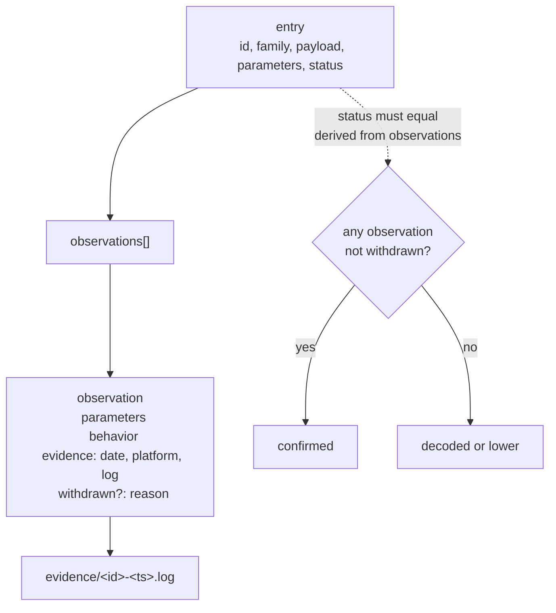
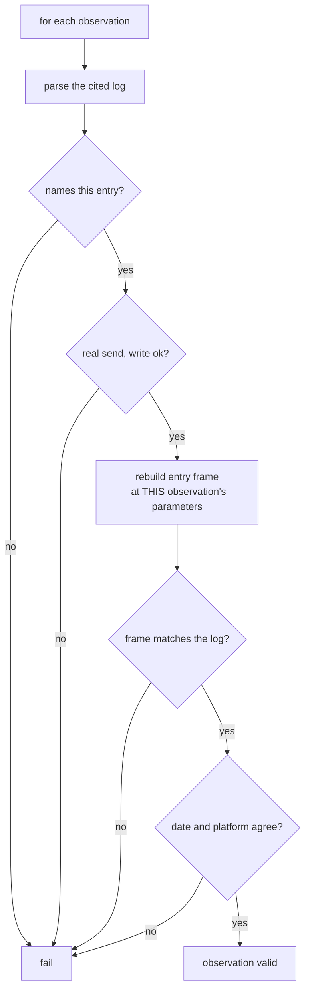

# Multi-Observation Schema - Plan

## Goal Capsule

- **Objective:** Let one command entry carry many hardware observations, each independently evidenced, so a parameterized command is documented across its parameter space instead of at a single point — and ingest the findings currently parked outside the reference.
- **Product authority:** The Product Contract lives in the origin plan (`docs/plans/2026-08-11-001-feat-ruko-1088-ble-protocol-plan.md`) and its R-IDs are shared. This plan changes how R4, R8 and R11 are recorded; it does not change what they require.
- **Authority hierarchy:** R-IDs win on product behavior. KTD-IDs win on implementation mechanism within their cited R constraints. Units override neither.
- **Stop conditions:** Stop and report rather than proceeding if a unit would let an observation reach the table without a committed log the invariant suite accepts, or would record a behaviour description not traceable to `docs/pending-observations.md` or this conversation.
- **Execution profile:** Brownfield with a data migration. No hardware needed — the robot is off and nothing here requires it.
- **Tail ownership:** The calling session owns commit, push and PR. CI exists.
- **Open blockers:** None.

---

## Product Contract

### Summary

An entry carries an `observations` list rather than a single observation. Each entry in that list has its own parameters, behaviour description and evidence log, and the honesty gate validates every one of them. The findings currently held in `docs/pending-observations.md` move into the table, and that notebook is retired.

### Problem Frame

`move_rocker` is one command spanning a six-byte parameter space. One hardware session produced roughly twenty-five distinct observations of it — twelve limb values resolving to six joints, the waist byte, walk-versus-slide, direction and speed. The schema holds one `observed_behavior`, one `observed_parameters` and one `hardware_evidence` per entry, so the second observation had nowhere to go.

They are parked in `docs/pending-observations.md`, whose first line says it is not evidence. The published reference still describes `move_rocker` as "walked forward". A reviewer named this before it happened: *confirmed is entry-scoped but the entry spans a parameter space*.

There is a second problem underneath. Two readings of payload byte 0 were published and withdrawn during that session. Both survive as prose, but the published table shows no sign either happened — so a reader cannot calibrate the reference against its own error rate.

### Requirements

Carried from the origin plan; R-IDs are shared with it.

- R3. The reference carries a command table covering the robot's full app-reachable command surface, each entry giving its byte encoding and the robot behavior it produces.
- R4. Every command table entry carries its verification state: confirmed on hardware, decoded but untested, or unmapped.
- R8. A command counts as documented only after the CLI has issued it and the resulting robot behavior has been observed.
- R11. The reference documents how each finding was obtained, so a reader with the same hardware can reproduce it.

### Acceptance Examples

- AE10. **Covers R4, R8.** Given an entry already carrying one observation, when a contributor confirms a second at different parameters, then both are recorded and neither overwrites the other.
- AE11. **Covers R8.** Given an entry whose observations list contains one whose log records a different frame than the entry rebuilds at that observation's parameters, when the invariant suite runs, then it fails and names the offending observation.
- AE12. **Covers R4.** Given an entry marked `confirmed` whose observations are all withdrawn, when the invariant suite runs, then it fails — a withdrawn observation does not support the status. Marked `decoded`, the same entry passes, so a fully-retracted finding is representable rather than forcing its own deletion.
- AE13. **Covers R11.** Given a withdrawn observation, when the reference is generated, then the retraction and its reason appear in the published document rather than only in commit history.
- AE14. **Covers R8.** Given a withdrawn observation whose log names a different entry, when the invariant suite runs, then it fails — withdrawal never exempts an observation from log validation.
- AE15. **Covers R4.** Given two observations on one entry citing the same log, when the invariant suite runs, then it fails.

### Scope Boundaries

**Deferred to Follow-Up Work**

- Re-running any sweep against hardware. This plan records what was already observed.
- A CLI command for withdrawing an observation. Retracting a published claim should be a deliberate hand-edit, and the gate accepts one either way.
- Characterising byte 0 beyond walk-versus-slide, and the `0xB5` and `0xB2` families.

**Outside this effort**

- Security framing, per the origin's KD4.

### Dependencies / Assumptions

- **Assumption — the scratch logs are valid evidence.** 198 logs in `.carle/sweep-repeat/` are `kind: send` records of real sends to the real robot. Only a `--evidence-dir` flag chosen for tidiness separates them from committed evidence. This plan promotes only the logs an ingested observation cites. (session-settled: user-directed — chosen over leaving those findings in the notebook until re-run: the stricter reading would discard the elbows, the waist and walk-versus-slide, which are the session's best findings, on a filing distinction rather than an evidential one.)
- **Assumption — a behaviour description is a human report.** Nothing mechanical backs it, here or before. The gate checks internal consistency only, per the origin's stated limits.

### Outstanding Questions

**Deferred to Planning**

- Whether repeated observations at identical *parameters* should be deduplicated. Kept — a second observation at the same parameters from a different send is a repeatability data point. Two observations citing the same *log* are a different matter and are forbidden by KTD9.
- A structurally malformed `observations` value — not a list, or an element that is not a mapping — is rejected by `load_table` as a `TableError`, matching how the existing loader treats `payload` and `parameters`. Semantic rules stay in `validate_entry` with rule codes, preserving the split the current code makes deliberately.
- `confirmed` continues to require `family`, `payload` and `derivation`. Only the three observation fields move; U1 step 4 restates the observation clauses and leaves the rest of the state rules as they are.

---

## Planning Contract

### Key Technical Decisions

- KTD1. **`observations` is a list on the entry, not a separate file.** `table.py` is already the single owner of the schema and `save_table` already preserves the file's comment header; a sidecar would split ownership and need its own gate. Governs R4.
- KTD2. **Every observation's log is validated independently, against the complete existing rule set.** Per observation, the log must name this entry, be a real send rather than raw, record a successful write, carry the frame the entry rebuilds at *that observation's* parameters, have recorded parameters equal to the observation's, and agree on date and platform — and the date must not be in the future. That list is the whole of what `_validate_log_contents` and `_validate_evidence` do today; an enumeration that drops one silently deletes a guard when the entry-level fields go. Governs R8.
- KTD3. **`status` stays written in the file, and an invariant ties it to the observations in one direction only: `status` is `confirmed` if and only if at least one observation is not withdrawn.** Deriving status wholesale would make the YAML less readable and would break every `unmapped` and `unlocated` row, since observations say nothing about the difference between those. Storing it unchecked would let it drift. Governs R4.
- KTD4. **A withdrawn observation is first-class: it keeps its log, gains a reason, renders in the reference, and does not support `confirmed`.** Withdrawal changes exactly one thing — whether the observation supports the status. It never exempts the observation from log validation, or `withdrawn` becomes the flag that walks anything past the gate. Prose-only retractions would hide the two corrections from the published table, which is the opposite of what keeping corrections visible was for. (session-settled: user-approved — chosen over recording retractions only in prose: a reader who cannot see what the reference got wrong cannot calibrate it.) Governs R4, R11.
- KTD5. **`carle confirm` appends rather than refusing when the entry is already confirmed.** The current refusal exists to stop evidence being overwritten; appending does not overwrite. Governs R8.
- KTD8. **An observation may cite more than one log, because most of these findings came from a sequence rather than a single send.** The limb joints, the waist and the whole `p5` negative were read from alternating or swept sends; attaching such a finding to one arbitrary member log would make that log appear to back a behaviour it alone did not produce — the exact claim-versus-evidence gap per-observation validation exists to close. Every cited log must have been sent at the observation's own parameters, so a multi-log observation is a *repeated* send rather than a swept one — the frame check would fail otherwise, and rightly: a log at `p5=2` cannot back a claim about `p5=1`. A sweep is therefore many observations, one per value, each citing its own repeats, and the alternation that produced the reading is named in the behaviour text. Governs R8, R11.
- KTD9. **No two observations on an entry may cite the same log.** The main table publishes an observation count, which is a reader's measure of how widely a command was exercised; two observations over one send would read as two independent confirmations. Governs R4.
- KTD6. **The main table keeps one row per command; observations get their own section.** `move_rocker` alone will carry roughly twenty-five, and inlining them would bury a fifty-row table. The main row shows the frame at declared defaults, labelled as such, and an observation count.
- KTD7. **The promotion set is derived from the observations being ingested, not from grouping the scratch directory.** Grouping `.carle/sweep-repeat/` by parameters yields more groups than there are findings — seven `p5` groups back a single notebook row, and two `speed=50` mode groups appear in no row at all. Committing those would put logs for sends nobody watched into `evidence/`, and with KTD5 removing the already-confirmed refusal, each becomes a one-command path to minting a published observation with no hardware and no new send. Copy only what an ingested observation cites, and never move.

### High-Level Technical Design

The schema change, in the shape the file takes:

Validation, per observation rather than per entry:

### Migration

Three entries currently carry a single observation each. Each converts to a one-element `observations` list; the conversion is asserted by rebuilding each and comparing against the pre-migration fields before those fields are removed.

| Entry | Existing observation | Becomes |
|---|---|---|
| `media_music` | index at default, "Old MacDonald" | one observation, plus two more ingested from the notebook (index 1, index 2) |
| `media_story` | index 0, "Princess and the Pea" | one observation |
| `move_rocker` | `direction=3 speed=50`, "walked forward" | one observation, plus roughly twenty ingested |

### Evidence promotion

`.carle/sweep-repeat/` holds 198 logs covering observations with no committed evidence: `limb` 9–12 (the elbows), `p3` (the waist), `mode` 1 and 2 (walk versus slide), and the `p5` negative. Per KTD7 the promotion set comes from the notebook rows being ingested, not from grouping that directory — a log is copied into `evidence/` only because an observation will cite it. Sequence-derived findings cite several, so the set is not one-per-parameter-set. The rest stay uncommitted.

Committed evidence already covers `limb` 1–8, `direction`/`speed`, and the media commands, so those need no promotion.

### Sequencing

U1 and U2 land together — U1 removes fields U2's migration reads. U3 is independent and can land first. U4, U5 and U6 all depend on U1. U7 depends on the rest being settled.

---

## Implementation Units

### U1. Schema and per-observation validation

- **Goal:** Replace the three entry-level observation fields with a validated list.
- **Requirements:** R4, R8; governed by KTD1, KTD2, KTD3, KTD4
- **Dependencies:** None
- **Files:** `src/carle/table.py`, `tests/test_table_invariants.py`
- **Approach:**
  1. Add an `Observation` shape: `parameters` (mapping, may be empty), `behavior` (non-blank after stripping), `evidence` (`date`, `platform`, and `logs` — a non-empty list, since KTD8 lets a sequence-derived finding cite every log in its sequence), and optional `withdrawn` carrying a non-blank reason.
  2. Replace `observed_behavior`, `observed_parameters` and `hardware_evidence` on the entry with `observations`. Remove them from `_OPTIONAL` and from `Entry`.
  3. Apply the existing log rules to every log of every observation, rebuilding the frame at that observation's own parameters. Keep the existing rule codes and add an observation index — and a log index where an observation cites several — to each message so a failure names which one.
  3a. Add the KTD9 rule: across an entry's observations, no log path appears twice.
  4. Restate the observation clauses of the state rules, leaving the rest as they are: `unmapped` and `unlocated` carry no observations at all; `decoded` may carry observations provided every one of them is withdrawn, so a fully-retracted finding stays in the record instead of having to be deleted; `confirmed` requires at least one observation that is not withdrawn. `confirmed` continues to require `family`, `payload` and `derivation`.
  5. Add the KTD3 invariant: the written `status` must equal the status the observations imply.
  6. Keep `_validate_log_path` unchanged — it already bounds paths to `evidence/`, requires a real non-empty file, and rejects absolute paths and traversal.
- **Execution note:** This is the honesty gate. Write the failing fixtures before the rules — a previous version of this gate passed everything because it checked a path and never opened the file. Every fixture carries at least two observations, so a loop that validates the first and returns early cannot pass.
- **Patterns to follow:** the existing `validate_entry` / `_validate_log_contents` split and the bracketed rule-code convention that tests match on.
- **Test scenarios:**
  - Covers AE10. An entry with two observations at different parameters, each with a matching log, passes.
  - Covers AE11. An entry whose second observation cites a log recording a different frame fails, and the message names the second observation.
  - Covers AE12. An entry marked `confirmed` whose only observation is withdrawn fails the status-agreement rule.
  - Covers AE12. The same entry marked `decoded` passes — a fully-retracted finding does not force its own deletion.
  - An entry marked `decoded` carrying one live observation fails.
  - An entry marked `unmapped` carrying an observation, withdrawn or not, fails.
  - Covers AE14. An entry with one live and one withdrawn observation, where the withdrawn one's log names a different entry, fails and names the withdrawn observation.
  - Covers AE15. Two observations citing the same log path fail, whether that path is one of several on either observation or the only one.
  - An observation citing three logs passes when all three match, and fails when only the third does not — the failure names the third.
  - An observation with an empty `logs` list fails.
  - An observation whose log's recorded parameters differ from the observation's parameters fails, even when the resulting frames are identical.
  - An observation dated in the future fails.
  - An observation with a blank or whitespace-only `behavior` fails.
  - An observation missing `evidence` fails.
  - A withdrawn observation with a blank reason fails.
  - An entry with one withdrawn and one live observation is validly `confirmed`.
  - An observation whose log names a different entry fails.
  - An observation whose log is a raw send fails.
  - An observation whose log date disagrees with its `evidence.date` fails.
  - The real table passes every invariant after migration.
- **Verification:** `uv run pytest tests/test_table_invariants.py` passes, and each malformed fixture fails on its own rule code.

### U2. Migrate the existing entries

- **Goal:** Convert the three confirmed entries to the list shape without changing what they claim.
- **Requirements:** R4
- **Dependencies:** U1
- **Files:** `protocol/commands.yaml`, `tests/test_table_invariants.py`
- **Approach:**
  1. Each existing observation becomes a one-element list preserving its parameters, behaviour and evidence verbatim.
  2. Assert the conversion before the old fields are deleted: for each entry, the migrated observation's parameters, behaviour and evidence must equal the pre-migration values.
  3. Leave `media_music`'s behaviour text as written, including its `CONFOUNDED` note. U6 will split it into per-index observations; this unit changes shape only.
- **Execution note:** Shape change only. If any behaviour text changes in this unit, something has gone wrong.
- **Patterns to follow:** the migration proof in `tests/test_frame.py`, which pins pre-migration values in the test file itself.
- **Test scenarios:**
  - Each of the three entries has exactly one observation after migration.
  - Each migrated observation's behaviour text matches the pinned pre-migration value.
  - `move_rocker`'s migrated observation carries `direction=3 speed=50`.
  - No entry retains an `observed_behavior`, `observed_parameters` or `hardware_evidence` key.
- **Verification:** the table loads, validates clean, and the pinned comparisons hold.

### U3. Promote the scratch evidence

- **Goal:** Give the unevidenced findings committed logs.
- **Requirements:** R8, R11; governed by KTD7
- **Dependencies:** None
- **Files:** `evidence/*` (added), `CONTRIBUTING.md`
- **Approach:**
  1. Derive the promotion set from `docs/pending-observations.md` — the logs the ingested observations will actually cite — not from grouping the scratch directory. Grouping yields more sets than there are findings: seven `p5` parameter groups back one notebook row, and two `speed=50` mode groups appear in no row at all.
  2. Copy the earliest matching log for each cited parameter set into `evidence/`, preserving its filename so its timestamp still identifies it.
  3. Skip any set that already has committed evidence.
  4. Note in `CONTRIBUTING.md` that a log's directory is a filing choice and not what makes it evidence — what makes it evidence is being a real send, committed, and consistent with the entry.
- **Execution note:** Copy rather than move, and verify each promoted log parses through `evidence.read_log` before committing it. A log that cannot be parsed cannot support an observation, and finding that out at ingest time is cheaper than at gate time.
- **Patterns to follow:** `src/carle/evidence.py`'s `read_log` for parsing and `logs_for` for the naming convention.
- **Test scenarios:** Test expectation: none — this unit adds data files. U6's ingest is what proves they are usable, and the invariant suite is what proves they are valid.
- **Verification:** every parameter set an ingested observation cites has exactly one committed log, each parses, and no promoted log is left uncited. A committed log nobody watched is a send waiting to be minted into an observation.

### U4. `carle confirm` appends

- **Goal:** Let a second observation be recorded without overwriting the first.
- **Requirements:** R8; governed by KTD5
- **Dependencies:** U1
- **Files:** `src/carle/cli.py`, `tests/test_cli.py`
- **Approach:**
  1. Drop the already-confirmed refusal. Appending does not overwrite, which is what that refusal protected.
  2. Build the new observation from the chosen log — its parameters, the supplied behaviour, and its date, platform and path as a single-element `logs` list — and append it. Citing several logs is a hand-edit; the CLI sees one send at a time.
  3. Keep every existing refusal: no log, a log whose frame no longer matches, a raw log, a blank behaviour, a log outside `evidence/`, and the ambiguity refusal when more than one promotable log exists without `--log`. Add one: refuse a log already cited by an observation on that entry, per KTD9.
  4. Note that `--log` becomes effectively mandatory for `move_rocker` once its logs are committed, since the ambiguity refusal will fire every time. That is intended, not a regression.
  5. Report how many observations the entry now carries, so a contributor sees the list growing.
- **Patterns to follow:** the existing `_run_confirm` structure and its use of `save_table`.
- **Test scenarios:**
  - Covers AE10. Confirming a second observation at different parameters leaves both present and the first unchanged.
  - The appended observation records the parameters from its own log, not from the previous one.
  - Confirming with no log still refuses.
  - Confirming with a frame-mismatched log still refuses.
  - Confirming with a raw log still refuses.
  - A blank `--behavior` still refuses.
  - Two promotable logs without `--log` still refuses and lists the candidates.
  - `--log` naming a specific file appends that one.
  - Covers AE15. Confirming twice with the same `--log` refuses the second time.
  - The comment header and `coverage_note` survive an append.
  - The resulting table passes `validate_table`.
- **Verification:** `uv run pytest tests/test_cli.py` passes and a manufactured second log appends cleanly.

### U5. Render observations

- **Goal:** Publish the observations without burying the command table.
- **Requirements:** R3, R4, R11; governed by KTD4, KTD6
- **Dependencies:** U1
- **Files:** `scripts/generate_reference.py`, `tests/test_reference_generation.py`, `docs/protocol-reference.md`
- **Approach:**
  1. The per-category table keeps one row per command. Its frame column shows the frame at declared defaults and the column header says so, since an entry with many observations has no single frame. An observation count replaces the single behaviour cell.
  2. Add an observations section per entry that has any: parameters, the frame built at those parameters, the behaviour, and a link to each cited log. Where a finding cites several, show them all — the count is what tells a reader it came from a sequence.
  3. Render a withdrawn observation in the same table, marked as withdrawn and carrying its reason. It is part of the record, not a footnote.
  4. Regenerate.
- **Patterns to follow:** the existing `cell()` escaping and the `../` prefix on evidence links, both of which came from review findings.
- **Test scenarios:**
  - An entry with three observations renders three rows in its observations section.
  - Each observation row shows the frame built at that observation's parameters, not at defaults.
  - The main table's frame column is labelled as showing defaults.
  - Covers AE13. A withdrawn observation appears in the rendered output with its reason.
  - A withdrawn observation is visually distinguished from a live one.
  - An entry with no observations renders no observations section.
  - Evidence links resolve from `docs/`, including every link of a multi-log observation.
  - Regeneration is byte-identical against an unchanged table and `--check` still detects drift.
  - The hand-written prose guards still hold — no byte literals outside the spec sections, no command ids, no verification vocabulary outside the legend.
- **Verification:** `generate_reference.py --check` exits zero and the published document shows every observation.

### U6. Ingest the parked findings

- **Goal:** Move the notebook into the table.
- **Requirements:** R4, R8, R11
- **Dependencies:** U1, U2, U3, U5
- **Files:** `protocol/commands.yaml`, `docs/pending-observations.md` (removed), `docs/protocol-reference.md`
- **Approach:**
  1. For each row in `docs/pending-observations.md`, add an observation to its entry: the parameters, the behaviour text, and every evidence log that backs it. Most of these findings came from a sequence rather than one send — the limb joints, the waist and the `p5` negative were all read from alternating or swept sends — so those cite every log in the sequence, per KTD8.
  2. Do not ingest a row the notebook marks as inferred rather than watched. `limb=2` is the case: its row says "not separately seen — implied as the left-arm return by the 3/4 pairing". A committed log for it exists, so an observation would pass every gate rule and publish an inference behind an evidence link. Record it in the hand-written prose instead.
  3. Split `media_music`'s current single behaviour into three observations — index 0, 1 and 2 — each citing its own log. The `CONFOUNDED` note about later content belongs on the index 2 observation, where it arose.
  4. Record the two withdrawn readings of byte 0 as withdrawn observations with their reasons: first read as a rotation in place, then as a leg selector, both corrected by watching.
  5. Any parked row whose log is not committed after U3 is not ingested. Say so explicitly in the commit rather than dropping it silently.
  6. Move the notebook's cross-cutting findings — the ones belonging to no single entry — into the reference's hand-written prose before deleting it. Poses holding, commands queuing and the idle-routine constraint are already published there; the `p5` methodology detail and the remote-photograph prediction are not, and would otherwise be lost.
  7. Delete `docs/pending-observations.md`. Its contents now live in the table and the reference, which is the point.
- **Execution note:** Behaviour text is the contributor's words. Carry it across as written rather than tidying it — "as though it was going to shake someone's hand" is better documentation than a paraphrase.
- **Patterns to follow:** `docs/pending-observations.md` itself, which already pairs each observation with its log filename.
- **Test scenarios:**
  - The real table passes every invariant with all observations ingested.
  - `move_rocker` carries an observation for each limb value that was separately watched — 1 and 3 through 12 — and none for `limb=2`.
  - Every observation's cited log exists in `evidence/` and parses.
  - The two withdrawn byte 0 readings are present and marked withdrawn.
  - `media_music` carries three observations, one per index tested.
  - No ingested observation cites a log under `.carle/`.
  - Every observation derived from an alternating or swept sequence cites more than one log.
  - No two observations cite the same log.
- **Verification:** the notebook is gone, the reference shows the findings, and the standalone CI table check passes.

### U7. Documentation

- **Goal:** Describe the list, the append, and what a withdrawal means.
- **Requirements:** R11
- **Dependencies:** U1, U4, U5, U6
- **Files:** `CONTRIBUTING.md`, `docs/method.md`, `docs/protocol-reference.md`, `README.md`
- **Approach:**
  1. Update the status table in `CONTRIBUTING.md` for the list shape, and state that `confirmed` means at least one live observation.
  2. Document withdrawal: what it is for, that it is a deliberate hand-edit rather than a command, and that a withdrawn observation keeps its log.
  3. Update `docs/method.md` so the recording step describes appending an observation rather than promoting an entry once.
  4. Update the reference legend and the README status table.
- **Test scenarios:** Test expectation: none — documentation only. The syntax it describes is covered by U4's tests.
- **Verification:** no document still describes one observation per entry.

---

## Verification Contract

| Gate | Command | Applies to | Signal |
|---|---|---|---|
| Unit tests | `uv run pytest` | U1-U7 | All tests pass |
| Lint | `uv run ruff check .` | All units | No findings |
| Format | `uv run ruff format --check .` | All units | No diff |
| Honesty gate | `uv run pytest tests/test_table_invariants.py -q` | U1, U6 | No observation claims unearned verification |
| Table is valid | the standalone check in `.github/workflows/ci.yml` | U1, U2, U6 | Zero problems |
| Forged observation fails | a fixture citing a mismatched log | U1 | Rejected without the CLI running |
| Reference is current | `uv run python scripts/generate_reference.py --check` | U5 | Exits zero |
| Migration is faithful | `uv run pytest tests/test_table_invariants.py -k migration` | U2 | Pinned pre-migration values match |

---

## Risks & Dependencies

- **This edits the honesty gate.** The rule is applied per observation rather than per entry, which means a mistake multiplies rather than appearing once. The specific failure to guard against is a loop that validates the first observation and returns early — every fixture should use at least two.
- **The promotion is a judgement call, and the plan says so.** Copying a log out of a gitignored directory into `evidence/` makes it evidence. That is defensible because the logs are real sends and the directory was a filing choice, but a reader deserves to know it happened; the commit should state it plainly rather than letting the logs appear as though they were always there.
- **`media_music`'s existing behaviour text is already known to be partly wrong.** It carries a `CONFOUNDED` note about content that turned out to be the robot's idle routine. Splitting it into three observations is an opportunity to attach that note where it belongs — and a risk of quietly dropping it.
- **The published document will grow substantially.** Roughly twenty-five observations on one entry. If the observations section makes the reference unreadable, that is worth noticing during U5 rather than after.

---

## Definition of Done

**Global**

- `uv run pytest`, `uv run ruff check .` and `generate_reference.py --check` pass from a clean checkout.
- `protocol/commands.yaml` carries no `observed_behavior`, `observed_parameters` or `hardware_evidence` key.
- Every log every observation cites is committed under `evidence/`, parses, and matches the frame at that observation's parameters. No log is cited twice.
- A fixture observation citing a mismatched log fails the gate without the CLI running.
- `docs/pending-observations.md` no longer exists.
- The two withdrawn byte 0 readings appear in the published reference with their reasons.
- `carle confirm` appends to an already-confirmed entry and still refuses every case it refused before.
- No dead-end or experimental code remains in the diff.

**Per unit**

- U1 — every rule applies per observation; fixtures use two or more.
- U2 — shape change only; pinned behaviour text unchanged.
- U3 — every cited log committed and parsing, and no promoted log left uncited.
- U4 — appends without overwriting; every prior refusal intact.
- U5 — observations render, withdrawals visible, main table still readable.
- U6 — notebook deleted, nothing ingested without committed evidence.
- U7 — no document still describes one observation per entry.
