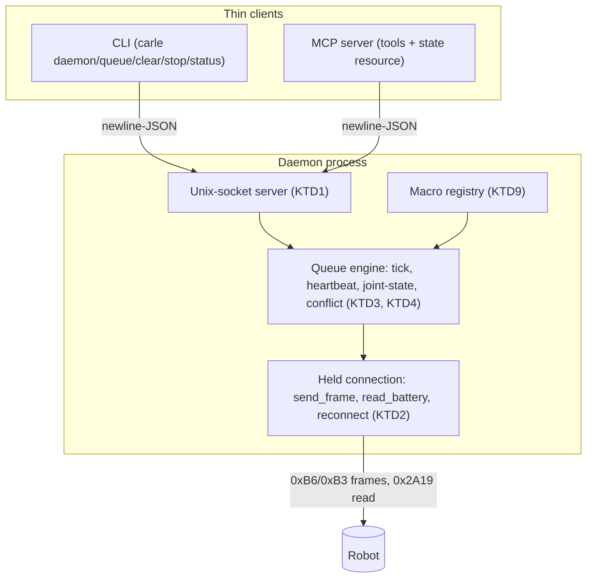

# Robot Control Plane - Plan

## Goal Capsule

- **Objective:** An always-on daemon that owns the robot's BLE link and runs a timed, multi-channel command queue — movement, media, and speech — with a heartbeat that keeps the robot's idle routine from ever taking over, driven by an AI through both a CLI and an MCP server.
- **Product authority:** This plan owns the control-plane daemon and its two client interfaces. The command protocol it drives is owned by `docs/protocol-reference.md`; the motion-to-primitive mapping is owned by `docs/movement-vocabulary.md`. Neither is redefined here.
- **Open blockers:** None. The robot's battery is dead, so nothing here is hardware-validated yet — that is a stated assumption, not a blocker on planning.

---

## Product Contract

### Summary

A single long-running process holds the robot's one BLE connection and executes an ordered queue of timed steps across every channel — poses and locomotion, media triggers, and spoken text. Whenever a second passes with nothing else sent, it emits a no-op frame so the robot's idle routine never gets its window while the link is held (a brief reconnect gap after a drop is the one exception, per KTD6). Two thin clients drive the same queue — a CLI and an MCP server — with `clear` and `stop` controls and live state readback, so an AI operates the robot with awareness instead of firing blind.

### Problem Frame

Left alone, the robot resumes its own idle routine — music, movement, speech — within a second or two of silence, using the same joints a command uses. Any control that connects, sends, and disconnects therefore fights the robot for authority and usually loses. The current `tools/keepalive.py` solves half of this: it holds the link and heartbeats a no-op so the robot stays still, but it can only stay still — it cannot *do* anything, and it reports nothing back. Driving a routine today means a bespoke script per routine, no way to queue or cancel work, and no visibility into whether the robot is even still connected or charged. This session's battery death mid-routine, discovered only when the robot went silent, is the shape of the cost: the operator was flying blind.

### Key Decisions

- **Daemon core with two thin clients (CLI + MCP).** The engine that owns the link, queue, heartbeat, and joint-state is built once; a CLI and an MCP server are thin adapters over the same control channel. *(session-settled: user-directed — chosen over a single interface: shell agents and MCP-native models should both drive it.)* Governs R11, R12, R13.
- **Heartbeat fires on a one-second silence floor.** A no-op frame goes out whenever a full second passes with nothing else sent on the BLE link. *(session-settled: user-directed — corrected from an initial "once a minute", which would let idle win.)* Governs R6.
- **The queue speaks primitives and named macros.** Atomic steps are the base language; named moves are macros that expand into servo-safe primitive sequences, so unmapped moves slot in without touching the engine. *(session-settled: user-directed — chosen over named-only or primitive-only.)* Governs R2.
- **`clear` and `stop` are separate verbs.** `clear` manages the plan; `stop` is the reset. *(session-settled: user-directed — chosen over a single combined verb.)* Governs R8, R9.
- **All channels are in scope, including speech.** Movement, media, and TTS are all step types on one timeline. *(session-settled: user-directed — chosen over movement-only or movement-plus-media.)* Governs R15.
- **Steps can overlap via await/spawn.** A step either blocks the queue until it completes or starts and lets the queue continue, so speech can run while the robot moves. *(session-settled: user-directed — chosen over a strictly sequential FIFO, accepting a per-joint conflict rule.)* Governs R3, R4.
- **The plane reports state, not just accepts commands.** Connection, battery, current pose, and queue contents are readable. *(session-settled: user-directed — chosen over command-only for v1.)* Governs R14.

### Actors

- A1. **AI agent** — drives the robot through the MCP server: enqueues steps and routines, clears, stops, and reads state as tools/resources.
- A2. **Operator (or shell agent)** — drives the same queue from the CLI, and manages the daemon's lifecycle.
- A3. **The daemon** — owns the single BLE connection, the queue, the heartbeat, and the tracked joint-state; the only writer to the robot.
- A4. **The robot** — executes frames, drops its BLE link periodically, and runs an idle routine whenever it is starved of frames.

### Requirements

**Queue and execution**

- R1. The daemon executes an ordered queue of steps over one held BLE connection.
- R2. A step is either an atomic primitive (a held pose, a locomotion move, a pause, a media trigger, a spoken line) or a named macro that expands into a sequence of primitive steps.
- R3. Each step is either *await* (the queue blocks until it completes) or *spawn* (the step starts and the queue proceeds), so a spawned step can run alongside later steps.
- R4. When two concurrent movement steps target the same joint, the daemon resolves the conflict by a single defined rule rather than sending both. The rule choice is deferred to planning.
- R5. All motion the daemon emits obeys the servo-safe timing in `docs/movement-vocabulary.md`: no joint's byte changes more often than the safe minimum, and any single emitted frame changes at most one joint from the previous frame — a guarantee that holds across concurrent tracks, not only within one (see KTD4). A *track* is one concurrently executing step lane: the main await queue, plus each live spawned step.

**Idle suppression**

- R6. Whenever a full second elapses with no frame sent on the BLE link, the daemon sends the no-op movement frame, so the robot's idle routine never gets its window while the link is held. Any real frame resets the timer. The one-second floor is a daemon-start parameter (default 1.0 s), not a hard-coded constant (KTD3, KTD7).
- R7. The heartbeat runs the whole time the daemon is connected — during pauses, and while spawned non-BLE steps (speech) are still playing.

**Control operations**

- R8. `clear` removes all pending steps; the step currently in flight finishes, after which the daemon holds on the heartbeat.
- R9. `stop` aborts the current step immediately and returns every non-neutral joint to rest, then holds on the heartbeat.
- R10. A caller can enqueue a single step or a whole routine (an ordered batch) in one operation.

**Interfaces**

- R11. A CLI drives the daemon — enqueue, clear, stop, read status — and manages the daemon's lifecycle (start, stop, is-it-running).
- R12. An MCP server exposes enqueue, clear, stop, list-moves, and state as tools/resources over the same daemon core.
- R13. Both interfaces act on one shared queue and one connection; concurrent requests serialize rather than racing.

**State readback**

- R14. The daemon reports, on request, its connection status, the robot's battery level (via the documented `0x2A19` read), what it is currently doing (current pose/step), and the pending queue — surfaced through the CLI and as an MCP resource.

**Channels**

- R15. The queue can sequence three channel step-types: movement/locomotion (`0xB6`), media triggers (`0xB3`), and spoken text via host text-to-speech. Speech plays through the host's selected default audio output; it reaches the robot only when the robot's `JT_Speaker` sink is paired and selected as that output — operator setup the daemon does not perform (KTD8). Whether audio and motion can run simultaneously is unverified hardware behavior deferred to a live session.

**Resilience and lifecycle**

- R16. On a BLE link drop, the daemon reconnects and resumes the queue; the queue is held in the daemon independent of the connection and survives the drop.
- R17. The daemon is the sole holder of the robot's BLE link. It supersedes `tools/keepalive.py`, and a second instance must not contend for the connection.

### Key Flows

- F1. **Run a routine.** *Trigger:* a caller enqueues an ordered routine (e.g. raise-left-arm, pause, spawn "say hello", raise-right-arm). The daemon executes each step in order per R2/R3, expanding macros to servo-safe primitives (R5), running the spawned speech alongside the arm moves, and heartbeating throughout (R7).
- F2. **Suppress idle.** *Trigger:* the queue is empty or paused. Per R6, the daemon sends a no-op every second of silence; the robot holds position and never enters its idle routine.
- F3. **Clear.** *Trigger:* a caller issues `clear`. Per R8, pending steps drop, the in-flight step completes, and the daemon falls back to the heartbeat hold.
- F4. **Stop.** *Trigger:* a caller issues `stop`. Per R9, the current step aborts and the daemon walks every raised joint back to neutral, then holds.
- F5. **Survive a drop.** *Trigger:* the robot drops the BLE link mid-routine. Per R16, the daemon reconnects and resumes the queue, re-running the interrupted step; idle may briefly fire during the reconnect gap.

### Acceptance Examples

- AE1. **Covers R6.** Given the daemon is connected and nothing has been sent for one second, when the timer elapses, then it sends the no-op frame.
- AE2. **Covers R3, R7.** Given a routine with a spawned "say" step followed by movement steps, when it runs, then the speech plays while the movement steps execute and the heartbeat keeps firing.
- AE3. **Covers R4.** Given two concurrent movement steps that target the same joint, when they overlap, then the daemon applies its conflict rule and does not send both raw.
- AE4. **Covers R8.** Given a non-empty queue with a step in flight, when `clear` is issued, then pending steps are dropped, the in-flight step finishes, and the daemon holds on the heartbeat.
- AE5. **Covers R9.** Given the robot holds a raised-arm pose, when `stop` is issued, then the arm returns to neutral and the daemon holds.
- AE6. **Covers R16.** Given a routine is running when the link drops, when the daemon reconnects, then the queue resumes from the interrupted step rather than being lost.
- AE7. **Covers R13.** Given the CLI and the MCP server both enqueue, when they act, then both land on the same queue in a serialized order.

### Scope Boundaries

**Deferred for later**

- The *contents* of the named-move library and the still-unmapped leg-forward code — the engine is extensible; populating the vocabulary is follow-on work.
- Cross-platform TTS — v1 uses the host's speech (macOS `say`); speech on other platforms comes later.
- Parallel *movement* choreography beyond the single conflict rule of R4 — richer multi-track motion is out of v1.
- Remote or multi-robot control — v1 is one local robot, one daemon.

**Outside this work's identity**

- The daemon is a runtime control tool, not a documented command entry — it does not pass through the repository's evidence/honesty gate, which governs the protocol table, not tooling.

### Dependencies / Assumptions

- **Depends on** `src/carle/frame.py` and `src/carle/transport.py` (frame building and BLE writes), `docs/movement-vocabulary.md` (the move-to-primitive mapping and servo-safe timing), and `tools/keepalive.py`, whose heartbeat this supersedes (kept deprecated-pending-hardware per U7).
- **Assumption — the idle timer is ~1–2 seconds.** Observed once; the one-second heartbeat floor is derived from it but untested. The floor is a `daemon start` parameter (KTD3) precisely so it can be retuned once measured.
- **Assumption — one holder per link, but macOS may not enforce it.** Only one process *should* hold the BLE connection, which is what makes R17 a hard constraint; but macOS CoreBluetooth can broker a peripheral to multiple processes, so the daemon does not rely on the OS refusing a second writer — KTD10 makes `carle send/connect/info` refuse proactively.
- **Assumption — battery is readable at `0x2A19`.** Documented from the app; not yet read from a live robot.
- **Deferred hardware validation (charged-robot session).** Nothing here is hardware-validated. The live pass must: measure the real idle window and tune the silence floor; confirm the servo-safe cadence and the cross-track composition guard do not squeal; verify the neutral-return and per-type reconnect resume; confirm whether the robot acts on a multi-joint frame; check whether audio and motion run simultaneously with `JT_Speaker` as the host output; and read the battery. Only after the heartbeat validates is `tools/keepalive.py` deleted (U7).

### Outstanding Questions

The five items the brainstorm deferred to planning are now resolved in the Planning Contract: the control-channel mechanism (KTD1), the per-joint conflict rule (KTD4), a spawned step's lifetime (KTD5), reconnect granularity (KTD6), and daemon lifecycle and single-instance (KTD7). No question blocks implementation.

---

## Planning Contract

**Product Contract preservation:** unchanged — no R/A/F/AE ID was renumbered, split, or rescoped. Planning only resolved the deferred Outstanding Questions into the KTDs below.

### Key Technical Decisions

- KTD1. **Control channel: an asyncio Unix-domain socket carrying newline-delimited JSON.** The daemon serves a local socket (`asyncio.start_unix_server`, standard library, no new dependency); the CLI and the MCP server are both thin JSON clients. Resolves the deferred control-channel question. Rejected: local HTTP (needs a third-party async server or a threaded stdlib server fighting the asyncio loop). v1 targets macOS and Linux — `asyncio.start_unix_server` is absent on Windows — and `protocol.py` stays transport-agnostic so a localhost-TCP fallback can slot in there later. Governs R11, R12, R13.
- KTD2. **A held connection wraps one `BleakClient`, absorbing `tools/keepalive.py`.** It exposes `send_frame` and `read_battery`, and reconnects on drop; the queue lives above it and survives a drop untouched. Mirrors the held-connection/reconnect pattern already in `tools/keepalive.py` and the write pattern in `src/carle/transport.py`. Governs R1, R16, R17.
- KTD3. **The engine runs a fixed ~100 ms tick; the heartbeat is a silence-floor on that tick.** Each tick sends the current target frame when it changed, and otherwise sends the no-op once the silence floor (default 1.0 s) has passed since the last write. Servo-safe cadence (a joint target holds ~0.5 s) is enforced by macro expansion producing repeated steps *and* by the KTD4 composition guard, not by slowing the tick. The floor is a `daemon start` parameter, so a live robot whose real idle window turns out shorter is retuned by a flag rather than an engine edit (mirroring the `--interval` flag `tools/keepalive.py` already carries). Governs R5, R6, R7.
- KTD4. **One shared movement target, last-writer-wins, with a composition guard.** The engine keeps a single six-byte movement target; concurrent tracks write their joint bytes and the latest write wins. But the composed frame is rate-limited before it goes out: no joint byte changes more often than the servo-safe minimum regardless of which track wrote it, and any emitted frame changes at most one joint byte from the previous frame (later changes wait for the next eligible tick). This closes two gaps a bare last-writer-wins leaves open — a cross-track target that flips a joint every ~100 ms tick (the squeal failure mode in `docs/movement-vocabulary.md`), and a single frame carrying two non-zero joint bytes (whether the robot even acts on a compound multi-joint frame is an open protocol question there). Resolves the deferred conflict-rule question. Rejected: per-joint locking (heavier than needed); bare last-writer-wins (unsafe per above). Governs R4, R5.
- KTD5. **Spawn lifetime: `await` blocks the queue; `spawn` starts and is not awaited — and the engine tracks every live spawn.** A `say` step runs the host TTS process — blocking when `await`, backgrounded when `spawn`; a media trigger is a one-shot send. The engine holds a handle to each live spawned step (including TTS subprocess handles). `stop` terminates every spawned step — killing TTS subprocesses and removing spawn tracks — *before* the neutral return, so a reset actually silences and stills the robot rather than leaving a spawn track re-writing the target on the next tick. `clear` lets in-flight spawns finish, matching its let-current-finish semantics. Resolves the deferred spawn-lifetime question. Governs R3, R8, R9.
- KTD6. **Reconnect resumes at the step boundary, with a per-type resume policy — not a blanket re-run.** Idempotent steps (`pose`, `pause`) re-run from their start, which is safe. Non-idempotent steps do not: an interrupted locomotion `move` is dropped rather than re-run (re-running would double the travel), and a `say`/`media` trigger that may already have landed before the drop was detected is not re-fired (avoids a repeat). The idle routine may briefly fire during the reconnect gap. Resolves the deferred reconnect-granularity question. Governs R16.
- KTD7. **Lifecycle: `carle daemon start ADDRESS|stop|status`; single-instance via a socket-plus-lock under `.carle/`.** The socket and lock file sit under `.carle/` (beside the existing raw-log directory). `daemon start ADDRESS` runs the server and backgrounds by spawning a detached subprocess of the foreground server; a `--foreground` flag stays in the foreground for debugging, and the silence-floor value is a `start` parameter. `daemon stop` sends a `shutdown` protocol verb — distinct from the robot-reset `stop` — which stills the robot, removes the socket, and exits. Binding the socket fails when a daemon is already running; a stale socket from a crashed run is detected by attempting a connection and, on connection-refused, removing it before binding. Resolves the deferred lifecycle question. Governs R6, R11, R17.
- KTD8. **TTS is host-side and reaches the robot only via the paired sink; the MCP SDK is optional.** TTS shells out to the host speech tool (`say` on macOS), which plays through the host's *selected* default audio output — so it reaches the robot only when `JT_Speaker` is paired and selected as that output. The daemon neither routes audio nor pairs the sink; that is operator setup, documented in U7. Where no speech tool is present a `say` step degrades to a logged no-op rather than raising — owned and tested in U3, the engine path that runs it. The `mcp` package is an optional dependency; the core daemon and CLI need only `bleak` and the standard library. Governs R12, R15.
- KTD9. **Named moves are registry data, not engine code.** A macro registry maps a move name to a primitive-step sequence, seeded from `docs/movement-vocabulary.md` (`wave` → arm sweep, `fist_pump`, `sway`); the unmapped leg-forward move slots in as a new entry without touching the engine. Governs R2.
- KTD10. **The existing `carle send|connect|info` verbs refuse while the daemon holds the link.** Each opens its own per-call `BleakClient` (`src/carle/transport.py`), so with the daemon running they would be a second, unserialized writer — the contention R17 forbids, and one macOS CoreBluetooth may silently allow. Before connecting, each checks for a live daemon socket and, if present, prints `daemon holds the link — use \`carle queue\` or stop the daemon` and exits non-zero. Governs R13, R17.

### High-Level Technical Design

The engine's tick, in shape (directional, not implementation): every ~100 ms, compose the target frame from each active track's latest joint writes (last-writer-wins), then apply the KTD4 guard — emit at most one joint change from the previous frame and never faster than the servo-safe minimum; if the guarded frame differs from the last sent frame, send it; else if the silence floor (default 1.0 s) has elapsed since the last write, send the no-op. Advance the queue cursor when the current `await` step's hold elapses; start `spawn` steps without blocking and keep a handle to each. On a send raising a connection error, hand off to the held connection's reconnect and apply the current step's per-type resume policy (KTD6).

### Sequencing

U1 (held connection) and U2 (step and macro model) are independent — U2 builds frames through `carle.frame` and the vocabulary, not the connection — and both feed U3 (engine); U4 (server) wires them behind the socket. U5 (CLI) and U6 (MCP) both depend on U4 and can land in either order. U7 (docs + retiring keepalive) depends on U6 and lands last, so the README describes both settled clients.

---

## Implementation Units

### U1. Held BLE connection manager

- **Goal:** A persistent connection that holds one `BleakClient`, sends frames, reads battery, and reconnects on drop — the single writer to the robot.
- **Requirements:** R1, R16, R17; governed by KTD2, KTD6.
- **Dependencies:** none.
- **Files:** `src/carle/daemon/__init__.py` (new), `src/carle/daemon/connection.py` (new), `tests/test_daemon_connection.py` (new).
- **Approach:**
  1. Wrap a held `BleakClient` (mirroring `tools/keepalive.py` and the write path in `src/carle/transport.py`): `send_frame(bytes)` writes without response, chunked via `transport.chunked`.
  2. `read_battery()` reads `0x2A19` on service `0x180F` (per `docs/protocol-reference.md`), returning `None` when the characteristic is absent.
  3. On a send/read hitting a dropped link, `send_frame` **raises** while kicking off a background reconnect (with backoff) — it does not transparently retry. Surfacing the error is what lets the engine own step resume per KTD6; a silent retry here would make KTD6 and AE6 unreachable. Expose `is_connected` and the last-write timestamp for the heartbeat floor.
  4. Serialize GATT operations on the one client so a status battery read (`0x2A19`) and a tick write never overlap on the same connection.
  5. Take a connection-double seam so the engine and tests never need real Bluetooth — mirror the injected-`Backend` pattern in `src/carle/cli.py`.
- **Patterns to follow:** `tools/keepalive.py` (held session + reconnect), `src/carle/transport.py` (`WRITE_CHARACTERISTIC`, `chunked`, lazy bleak import), the `Backend` injection seam in `src/carle/cli.py`.
- **Test scenarios:**
  - A frame is written to the control characteristic (fake client records it).
  - A send on a dropped link raises and kicks off a reconnect; a subsequent send after the reconnect lands.
  - `read_battery` returns the byte when the characteristic is present and `None` when absent.
  - A concurrent battery read and frame write do not interleave on the client (serialized).
  - `is_connected` and the last-write timestamp update across connect, send, and drop.
- **Verification:** `uv run pytest tests/test_daemon_connection.py` passes against the fake client; no real Bluetooth is touched.

### U2. Step model and macro registry

- **Goal:** The queue's language — atomic step types and named macros that expand into servo-safe primitive sequences.
- **Requirements:** R2, R3, R5, R15; governed by KTD5, KTD9.
- **Dependencies:** none — builds frames through `carle.frame` and the vocabulary, not the connection.
- **Files:** `src/carle/daemon/steps.py` (new), `src/carle/daemon/moves.py` (new), `tests/test_daemon_steps.py` (new).
- **Approach:**
  1. Define step types: `pose` (joint + hold), `move` (mode/speed/direction + hold), `pause` (duration), `say` (text), `media` (trigger). Each carries an `await`/`spawn` mode per KTD5.
  2. Build frames through `carle.frame` (`0xB6` movement, `0xB3` media); never hand-assemble bytes.
  3. Macro registry (KTD9): a name → ordered primitive steps, seeded from `docs/movement-vocabulary.md` (`wave`, `fist_pump`, `sway`), each expansion already servo-safe (≥~0.5 s holds, one joint per step per R5).
  4. Expansion is pure and testable; unknown names raise a clear error.
- **Patterns to follow:** `src/carle/frame.py` (`build`, `resolve`), the vocabulary tables in `docs/movement-vocabulary.md`.
- **Test scenarios:**
  - Each primitive step builds the expected frame via `carle.frame`.
  - `wave` and `fist_pump` expand to their documented servo-safe step sequences.
  - An expanded movement macro never changes two joints in one step (R5).
  - An unknown macro name raises rather than silently no-oping.
  - A `say`/`media` step carries its await/spawn mode intact.
- **Verification:** `uv run pytest tests/test_daemon_steps.py` passes; expansions match the vocabulary.

### U3. Queue engine

- **Goal:** The tick loop that executes the queue, enforces the heartbeat, tracks joint-state, and answers the control operations.
- **Requirements:** R1, R4, R5, R6, R7, R8, R9, R10, R14, R16; governed by KTD3, KTD4, KTD5, KTD6, KTD8.
- **Dependencies:** U1, U2.
- **Files:** `src/carle/daemon/engine.py` (new), `tests/test_daemon_engine.py` (new).
- **Approach:**
  1. Hold the pending queue, the active tracks, the current six-byte movement target, handles to live spawned steps, and the last-write timestamp.
  2. Per KTD3: each ~100 ms tick composes the target (last-writer-wins), applies the KTD4 guard (at most one joint change per emitted frame, never faster than the servo-safe minimum), sends on change, else sends the no-op once the silence floor passes (R5/R6/R7).
  3. Control ops: `enqueue` (single or batch, R10); `clear` (drop pending, current finishes, in-flight spawns finish, R8); `stop` (terminate every spawned step incl. TTS subprocesses, then walk every non-neutral joint back using tracked state, R9 per KTD5); `status` (connection, battery, current step, pending — R14).
  4. On a send error, apply the current step's per-type resume policy after reconnect (KTD6): re-run `pose`/`pause`; drop an interrupted `move`; do not re-fire a `say`/`media` that may already have landed.
  5. Run a `say` step by shelling to the host speech tool, degrading to a logged no-op when absent (KTD8).
  6. Drive the engine from an injected clock/connection/subprocess-runner so tests advance ticks deterministically without sleeping or spawning real processes.
- **Execution note:** Write the heartbeat, clear/stop, and cross-track composition tests first — the idle-suppression floor, the neutral-return, and the servo-safe guard are the load-bearing behaviors, and a fake clock makes them exact.
- **Patterns to follow:** the injected-double seam from U1; `carle.frame` for the no-op frame (`B6 06 00 00 00 00 00 00 00 AA`).
- **Test scenarios:**
  - Covers AE1. After the silence floor with no writes, the tick sends the no-op.
  - Covers AE4. `clear` drops pending steps; the in-flight step still completes; an in-flight spawn keeps running; then only the heartbeat sends.
  - Covers AE5. With a raised-arm pose held, `stop` emits the joint's return and the target goes neutral.
  - Covers AE3. Two tracks targeting the same joint resolve last-writer-wins and emit one frame, not two.
  - A pose track and a waist track active together never emit a frame changing two joints in one tick (KTD4 guard); the second change waits for the next tick.
  - Two tracks alternately writing one joint never flip its byte faster than the servo-safe minimum.
  - Covers AE2. A spawned `say` step lets movement steps keep executing and the heartbeat keeps firing.
  - `stop` terminates a backgrounded `say` (the injected subprocess handle is killed) before the neutral return.
  - A `say` step with the host speech tool absent logs a no-op and the queue advances (KTD8).
  - Covers AE6. A send error mid-`pose` reconnects and re-runs that pose; an interrupted `move` is dropped, not re-run; an interrupted `media` is not re-fired.
  - `status` reports connection, battery, current step, and pending count.
  - A macro enqueue expands and executes as its primitive sequence.
- **Verification:** `uv run pytest tests/test_daemon_engine.py` passes with a fake clock, fake connection, and fake subprocess runner; ticks are deterministic.

### U4. Daemon server and control channel

- **Goal:** The process that runs the connection, engine, and heartbeat, and exposes the control operations over a Unix-socket JSON protocol with single-instance enforcement.
- **Requirements:** R11, R13, R17 (the shared channel *enables* R12/R15, which U6 satisfies); governed by KTD1, KTD7.
- **Dependencies:** U1, U2, U3.
- **Files:** `src/carle/daemon/protocol.py` (new), `src/carle/daemon/server.py` (new), `tests/test_daemon_server.py` (new).
- **Approach:**
  1. `protocol.py`: encode/decode newline-delimited JSON requests (`enqueue`, `clear`, `stop`, `status`, `list_moves`, and `shutdown` — the last terminating the daemon, distinct from the robot-reset `stop`) and responses — shared verbatim by both clients (KTD1).
  2. `server.py`: an `asyncio.start_unix_server` loop that dispatches requests to the engine; concurrent requests serialize on the engine (R13). Take the peripheral address and the silence-floor value at start (KTD3, KTD7).
  3. Single-instance (KTD7): the socket and a lock file under `.carle/`; a second start refuses; a stale socket is detected by attempting a connection and, on connection-refused, removed before binding.
  4. Run the connection, the engine tick, and the socket server on one asyncio loop; a `shutdown` request stops the tick, stills the robot (neutral/no-op), removes the socket, and exits.
- **Patterns to follow:** `src/carle/transport.py` asyncio usage; the engine/connection doubles from U1/U3 for tests.
- **Test scenarios:**
  - A round-trip: an `enqueue` request over the socket lands on the engine and returns success.
  - Covers AE7. Two concurrent clients enqueuing serialize onto one queue in order.
  - A second daemon start with the socket already bound refuses.
  - A stale socket file (no live daemon) is detected and cleared, and startup proceeds.
  - Malformed JSON returns a structured error, not a crash.
  - A `shutdown` request removes the socket and stops the tick.
- **Verification:** `uv run pytest tests/test_daemon_server.py` passes using an in-process socket and fake engine/connection.

### U5. CLI client

- **Goal:** Extend `carle` with daemon lifecycle and queue-control verbs that speak to the socket, and make the existing per-call verbs refuse while the daemon holds the link.
- **Requirements:** R8, R9, R10, R11, R13, R14, R17; governed by KTD1, KTD7, KTD10.
- **Dependencies:** U4.
- **Files:** `src/carle/cli.py` (modify), `tests/test_cli.py` (modify).
- **Approach:**
  1. Add subparsers: `daemon start ADDRESS [--foreground] [--interval SECONDS]`, `daemon stop`, `daemon status`, `queue <move|step...>`, `clear`, `stop`, `status` — mirroring the existing `build_parser`/`_run_*` structure. `daemon start` takes the address positionally (mirroring `tools/keepalive.py`) and stores it for reconnect; scan-based discovery is out of v1.
  2. `daemon start` backgrounds by spawning a detached subprocess of the U4 server; `--foreground` stays in the foreground for debugging. `daemon stop` sends `shutdown`; the queue/clear/stop/status verbs are thin socket clients that send one request and print the response.
  3. Per KTD10, `send`, `connect`, and `info` check for a live daemon socket before connecting and, if present, print `daemon holds the link — use \`carle queue\` or stop the daemon` and exit non-zero.
  4. Keep the injected-double seam so tests exercise the clients against a fake socket server without a running daemon.
- **Patterns to follow:** `src/carle/cli.py` (`build_parser`, `_run_send`, `main(argv, backend, ...)` injection).
- **Test scenarios:**
  - `carle queue wave` sends the expected enqueue request and prints the response.
  - `carle clear` and `carle stop` send their requests; output reflects the daemon's reply.
  - `carle status` renders connection/battery/current/pending from a status reply.
  - A verb issued with no daemon running prints a clear "is the daemon running?" error, not a traceback.
  - `carle send` with a live daemon socket refuses with the KTD10 message and exits non-zero; with no daemon it behaves as before.
- **Verification:** `uv run pytest tests/test_cli.py` passes; existing CLI tests remain green.

### U6. MCP server

- **Goal:** Expose enqueue, clear, stop, list-moves, and state to MCP clients as tools and a resource, over the same socket.
- **Requirements:** R12, R14, R15; governed by KTD1, KTD8.
- **Dependencies:** U4.
- **Files:** `src/carle/daemon/mcp_server.py` (new), `pyproject.toml` (modify — optional-deps group), `tests/test_daemon_mcp.py` (new).
- **Approach:**
  1. Map MCP tools (`enqueue`, `clear`, `stop`, `list_moves`) and a `status` resource onto the same socket-protocol requests as the CLI (KTD1) — the adapter is thin.
  2. Add `mcp` under an optional-dependencies group (KTD8); import it lazily so the core package installs and runs without it.
  3. Register a launch entry point an MCP client can start — a `carle-mcp` console script (and support `python -m carle.daemon.mcp_server`) — so the server is invocable, not just importable.
  4. Test the tool→request mapping with a fake socket, not a live MCP client.
- **Patterns to follow:** `src/carle/daemon/protocol.py` from U4; the lazy-import pattern in `src/carle/transport.py`.
- **Test scenarios:**
  - Each MCP tool call maps to the correct socket request and returns the daemon's reply.
  - The `status` resource returns the state snapshot.
  - Importing the core package without `mcp` installed does not fail; the MCP entry point degrades with a clear message.
  - `list_moves` returns the macro registry's names.
- **Verification:** `uv run pytest tests/test_daemon_mcp.py` passes; the base install needs no `mcp`.

### U7. Documentation and retiring keepalive

- **Goal:** Point the docs at the daemon and mark `tools/keepalive.py` deprecated (its heartbeat now lives in the daemon), without deleting it before any live validation.
- **Requirements:** R15, R17; governed by KTD8, KTD10.
- **Dependencies:** U1, U3, U4, U5, U6.
- **Files:** `README.md` (modify), `docs/movement-vocabulary.md` (modify), `tools/keepalive.py` (mark deprecated), `CONTRIBUTING.md` (modify if it references keepalive).
- **Approach:**
  1. README: replace the standalone keepalive mention with the daemon — `carle daemon start ADDRESS`, the queue verbs, the MCP entry point, that the daemon is now the sole link-holder and that `carle send/connect/info` refuse while it runs (R17, KTD10).
  2. Document TTS setup: speech reaches the robot only when its `JT_Speaker` sink is paired and selected as the host's audio output; the daemon does not route audio (KTD8, R15).
  3. movement-vocabulary: note that macros are the named-move source the engine expands, and that timing is servo-safe by construction.
  4. Mark `tools/keepalive.py` deprecated with a pointer to the daemon, but do not delete it yet — it is the single-purpose control experiment for the first charged-robot pass that validates the daemon's heartbeat against the idle timer. Its deletion is deferred until that pass succeeds.
  5. Carry the untested-on-hardware assumption into the README's status so no one reads the daemon as hardware-validated.
- **Test scenarios:** Test expectation: none — documentation and a deprecation marker only. The daemon's behavior is covered by U1–U6.
- **Verification:** README describes the daemon, its two clients, the coexistence rule, and the TTS-output setup; keepalive.py is marked deprecated rather than removed.

---

## Verification Contract

| Gate | Command | Applies to | Signal |
|---|---|---|---|
| Unit tests | `uv run pytest` | U1–U6 | All tests pass against fakes; no real Bluetooth |
| Lint | `uv run ruff check .` | all | No findings |
| Format | `uv run ruff format --check .` | all | No diff |
| Heartbeat floor | `uv run pytest tests/test_daemon_engine.py -k heartbeat` | U3 | No-op fires after the silence floor, default 1.0s (fake clock) |
| Clear vs stop | `uv run pytest tests/test_daemon_engine.py -k "clear or stop"` | U3 | Clear drops pending; stop returns joints to neutral |
| Single-instance | `uv run pytest tests/test_daemon_server.py -k instance` | U4 | Second start refuses; stale socket is cleared |
| Base install without MCP | import `carle` with `mcp` absent | U6 | Package imports; MCP entry degrades cleanly |

No gate runs against a live robot. Hardware validation — the heartbeat interval actually beating the idle timer, the servo-safe cadence, the neutral-return, reconnect-resume — is deferred to a charged-robot session, per the Assumptions.

---

## Definition of Done

**Global**

- `uv run pytest`, `uv run ruff check .`, and `uv run ruff format --check .` pass from a clean checkout.
- The daemon starts against an address, holds a (fake in tests) connection, executes an enqueued routine with servo-safe timing — the cross-track guard emits at most one joint change per frame and never faster than the safe minimum — heartbeats the no-op on the silence floor, and answers `clear`/`stop`/`shutdown`/`status`.
- Both clients drive the same queue: the CLI verbs and the MCP tools issue identical socket requests, serialized onto one engine.
- `stop` terminates spawned steps (including TTS subprocesses) before the neutral return; reconnect applies the per-type resume policy (re-run pose/pause, drop move, do not re-fire say/media).
- State readback returns connection, battery, current step, and pending queue.
- A second daemon instance refuses to start; the daemon is the sole link-holder, and `carle send/connect/info` refuse while it runs. `tools/keepalive.py` is marked deprecated (deletion deferred to a live heartbeat pass).
- No behavior is asserted against a live robot; the deferred hardware-validation list is stated in the README.
- No dead-end or experimental code remains in the diff.

**Per unit**

- U1 — held connection sends, raises-then-reconnects on a drop, reads battery, and serializes GATT ops against the fake client.
- U2 — step types build correct frames; macros expand servo-safe from the vocabulary.
- U3 — the tick, heartbeat, clear, stop (with spawned-step termination), the cross-track composition guard, per-type reconnect, and TTS degrade hold under fakes (AE1–AE6).
- U4 — socket round-trip works; concurrent clients serialize (AE7); single-instance enforced; `shutdown` verb tears down cleanly.
- U5 — daemon lifecycle and queue verbs speak to the socket; `carle send` refuses with a live daemon; existing CLI tests stay green.
- U6 — MCP tools map to socket requests; a launch entry point exists; base install needs no `mcp`.
- U7 — docs describe the daemon, its two clients, coexistence, and TTS setup; keepalive marked deprecated, not deleted.
