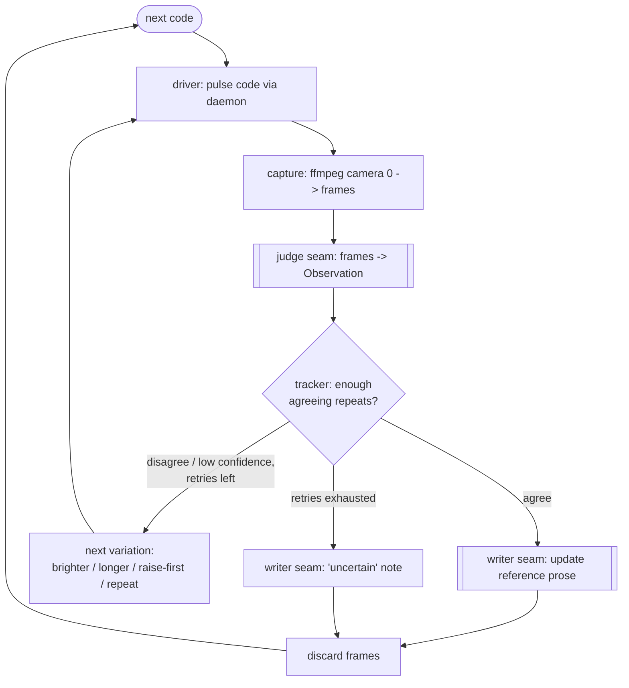

# Autonomous Movement Verification - Plan

## Goal Capsule

- **Objective:** Build an autonomous, camera-in-the-loop harness that derives what each robot movement command actually does — arms first — by firing a command, recording video from camera 0, reading the motion, and writing reproduced findings into the protocol reference, with no human in the loop.
- **Product authority:** This plan owns the arm-command verification loop. Other movement families (waist, locomotion, faces, media) are out of active scope; the harness is designed to generalize to them in later runs.
- **Execution profile:** Build the deterministic scaffolding (capture, drive, agreement/retry bookkeeping, reference writer, CLI) with tests against fakes — no camera or robot in CI, matching the repo's existing fake-based test convention. The vision judgment and the canonical prose edit are injected seams the orchestrating agent fulfills at run time.
- **Product Contract preservation:** Product Contract unchanged — planning added the Planning Contract and Implementation Units only; no requirement or Key Decision was altered.
- **Open blockers:** None for planning. Operational preconditions (a charged, reachable robot; a running daemon; camera 0 aimed at it; enough light) are run-time requirements, not planning blockers.

---

## Product Contract

### Summary

An unattended harness that re-derives the robot's movement-command mappings from scratch using the webcam as ground truth. For each arm code it drives one command through the daemon, records a short video from camera 0, reads the motion from sampled frames, and writes findings it can reproduce straight into the protocol reference — no human judges any step.

### Problem Frame

The current movement-code mappings were derived by hand, one still photo at a time, with a person judging each result. That was slow and subjective, and many codes came back "I couldn't tell." The mappings are only as trustworthy as a human squinting at a dim photo in the moment, and nothing re-checks them.

The robot can be watched by a camera instead. If the loop observes the hardware directly and re-derives each mapping unattended, the reference comes to reflect what the robot actually does rather than what a human read once — and it can be re-run whenever the mapping is in doubt.

### Key Decisions

- **Fully autonomous, no human in the loop.** The camera is the adjudicator; no step waits on human confirmation. (session-settled: user-directed — chosen over human-checkpointed verification: the whole point is a self-learning loop.) Governs R4, R5.
- **Derive from scratch; assume nothing works.** Existing documentation is treated as hypotheses to re-confirm, not ground truth. (session-settled: user-directed — chosen over verifying against the existing docs.) Governs R2, R6.
- **Video capture per code, not before/after stills.** A short clip spans the pose before the command through the motion settling. (session-settled: user-directed — chosen over a two-still diff: a gesture that animates and returns shows a net-zero pose change but visible mid-clip motion.) Governs R1, R2.
- **Reproducibility is the trust gate.** A finding is written only when independent repeats agree. (session-settled: user-directed — chosen over a machine-derived firewall layer or accept-and-self-correct: with no human and no retained evidence, agreement is what earns the right to edit canonical docs.) Governs R4.
- **Ambiguity resolves by retry-with-variation, then flag.** Bounded retries with brighter/longer capture or a different start pose, then "uncertain". (session-settled: user-directed — chosen over best-guess-with-confidence or retry-until-confident: never guess, never stall.) Governs R5, R8.
- **Ephemeral run, docs-only output.** Findings write into the reference; video and frames are discarded each run. (session-settled: user-directed — chosen over a committed structured mapping or committed evidence media: honors the repo's no-committed-binaries norm.) Governs R7, R8.
- **Reference by before/after within the video; no trusted reset.** Each code is judged relative to the pose that preceded it. (session-settled: user-directed — chosen over bootstrapping a reset command or a periodic re-home: resetting would require a command we cannot yet trust.) Governs R3.

### Requirements

**Observation loop**

- R1. For each in-scope arm code, the harness drives one command through the daemon, records a short video from camera 0 spanning the pose before the command through the motion settling, and samples frames to read what moved.
- R2. The harness reads each code's effect from the change across its own video — the pose before versus the motion and settled pose after — and assumes no code's behavior is known in advance.
- R3. Each code is judged relative to the pose immediately preceding it in the same video, so the loop needs no trusted reset command.

**Trust and reproducibility**

- R4. A finding is written only when reproduced: the harness re-derives each code at least one independent time and the readings must agree. Disagreeing readings are recorded as "uncertain", never as a confirmed mapping.
- R5. On an unreadable capture (dim lighting, a subtle joint, an animation that returns to its start), the harness retries with bounded variation — brighter or longer capture, a different starting pose to exaggerate the motion, repeated pulses — then marks the code "uncertain" rather than guessing. The loop never stalls on one code.
- R6. The harness overwrites an existing canonical entry when its reproduced reading disagrees with it; hand-documented findings are re-confirmed, not protected.

**Output**

- R7. Confirmed findings are written directly into the protocol reference (`docs/protocol-reference.md`, and `docs/movement-vocabulary.md` where relevant); captured video and frames are discarded after each run, with no retained evidence or separate mapping file.
- R8. An unresolved code leaves a prose "uncertain" note in the reference; resolving it requires a future re-run.

**Scope and safety**

- R9. The first run covers the arm-reaching set — the `0xB6` limb poses (1-12) and the `0xB2` hand-gesture codes (1-24). The loop is structured to apply to other movement families later without redesign.
- R10. Codes are driven through the existing daemon so servo-safety and idle handling are inherited: `0xB2` gestures pulse once (never streamed), `0xB6` poses may be held, and the heartbeat suppresses the robot's body-idle motion during observation.
- R11. The harness stops cleanly when the robot is unreachable (disconnect, dead battery) instead of hanging, and reports how far the run reached.

### Key Flows

- F1. Derive one code
  - **Trigger:** The harness selects the next arm code to derive.
  - **Steps:** Begin recording from camera 0; drive the code through the daemon; keep recording through the motion and settle; sample frames and read the motion; re-derive the code independently and compare the readings; on agreement, write the finding into the reference; on an unreadable capture, retry with variation up to the limit; on persistent disagreement or unreadability, mark the code "uncertain".
  - **Outcome:** The reference holds a reproduced finding or an "uncertain" note for the code; the video is discarded; the loop advances.

### Acceptance Examples

- AE1. **Covers R4.** Given a code whose two independent derivations disagree, when the harness finishes it, then the reference marks it "uncertain" and no confirmed mapping is written.
- AE2. **Covers R5.** Given a capture too dim to read, when the harness retries with a brighter and longer capture and still cannot read it within the retry limit, then it marks the code "uncertain" and advances to the next code.
- AE3. **Covers R1, R2.** Given a `0xB2` gesture that animates and returns to its starting pose, when judged from the video, then the harness reports the motion rather than "no change", because the motion is visible mid-clip.
- AE4. **Covers R6.** Given a code whose reproduced reading disagrees with the existing hand-documented entry, when the harness confirms its reading across repeats, then it overwrites the canonical entry.

### Success Criteria

- A run completes unattended end to end — no human input at any step — and stops cleanly if the robot drops.
- Every in-scope arm-code entry in the reference reflects a reproduced camera observation, with any unreadable code explicitly marked "uncertain" rather than guessed.

### Scope Boundaries

**Deferred for later**

- Other movement families — waist, locomotion, faces, media. The same loop applies to them in later runs; only the arm set is in this run.

**Outside this work**

- Retained evidence: committed frames or video, or any local evidence archive. Runs are ephemeral.
- A separate machine-readable mapping file. The protocol reference prose is the single durable output.
- Any human review, confirmation, or merge step.

### Dependencies / Assumptions

- Depends on the existing daemon (`carle queue gesture:N`, `pose:N`) and the ffmpeg + camera 0 capture path validated in the prior hardware session.
- Assumes a charged, powered-on robot reachable over BLE, camera 0 (MacBook Pro Camera) aimed at the robot, and enough light — or digital brightening — to read joint positions. Dim, poorly framed capture is the primary reliability risk (R5 exists to absorb it).
- Assumes the daemon's NOOP heartbeat suppresses the robot's body-idle motion during observation (seen in the prior session); the LED face cycles independently and is not part of the arm scope.

---

## Planning Contract

### Key Technical Decisions

- KTD1. **The vision judge and the reference-writer are injected seams the agent fulfills.** The loop takes a `judge(frames) -> Observation` callable and a `writer(result)` callable. In tests both are fakes; in a real autonomous run the orchestrating agent is the judge (it reads the sampled frames) and the writer (it edits the reference prose). This is how "no human in the loop" is realized without shipping a vision model — the intelligence is the agent, the code is deterministic scaffolding. Governs R1, R2, R6.
- KTD2. **A structured `Observation` is the unit of agreement.** The judge returns a small record (`code`, `joint`, `motion`, `direction`, `confidence`, `notes`) rather than free text, so the loop's reproducibility and ambiguity logic compare fields deterministically instead of interpreting prose. Governs R4, R5.
- KTD3. **Drive through the running daemon, never direct BLE.** The driver reuses `carle.daemon.client` and requires a live daemon (clear error otherwise), inheriting one-shot gesture pulses, held poses, and body-idle suppression. Governs R10, R11.
- KTD4. **Capture is ffmpeg → camera 0 → a scratch dir, brightened, and deleted per code.** Frames live only under an OS temp/scratch dir for the duration of one code's derivation and are removed afterward. Governs R7.
- KTD5. **The reference-writer edits canonical prose in place; no separate derived layer.** A confirmed finding rewrites the code's entry in `docs/protocol-reference.md` (agent-fulfilled at run time); an "uncertain" result records a prose note. This honors the rejected-derived-layer decision. Governs R6, R7, R8.
- KTD6. **Reproduction and retry parameters are config with defaults: two agreeing derivations confirm; a bounded variation ladder then "uncertain".** Default ladder order: brighter capture, longer capture, raise-the-limb-first to exaggerate, repeat the pulse. The raise-first rung deliberately changes the before-pose R3 compares against (using an as-yet-unverified pose as a fixture) to make a subtle motion legible; observations across variations still compare by joint and direction (KTD8). (session-settled: user-directed — chosen over retry-until-confident / best-guess: never guess, never stall.) Governs R4, R5.
- KTD7. **The in-scope code set is declared data, not control flow.** The loop iterates a list of `(family, code)` entries (arms: `0xB6` poses 1-12, `0xB2` gestures 1-24), so other families are added later as data. Governs R9.
- KTD8. **Agreement rule:** two `Observation`s agree when `joint` and `motion` direction match and both clear a confidence floor; anything else routes to retry, then "uncertain". Resolves the "agreement criteria" open question. Governs R4.

### High-Level Technical Design

The harness is a library of deterministic primitives plus an agreement/retry tracker, orchestrated per code. The judge and reference-writer are seams (agent at run time, fakes in tests).

### Assumptions

- ffmpeg is available on the run host (validated in the prior session); the harness surfaces a clear error when it is not, and CI never invokes it (fakes only).
- The daemon exposes `enqueue` for `gesture`/`pose`/`waist` items (built this session); the driver maps a code to one such request.
- Running the full loop against hardware is an agent session, not a CI job; all committed tests use injected fakes for capture, daemon, judge, and writer.

### Sequencing

U1 (capture) and U2 (driver) are independent and land first. U3 (tracker) depends on the `Observation` type it defines and is otherwise standalone. U4 (recorder/writer) depends on U3's result type. U5 (CLI) wires U1–U4. U6 (docs) lands last.

---

## Implementation Units

### U1. Frame capture from camera 0

- **Goal:** Record a short clip from camera 0 and extract brightened, sampled frames to a scratch dir, bounded in time and cleaned up after use.
- **Requirements:** R1, R3, R7. Advances KTD4. (R3: the clip brackets the pose that preceded the command, giving the judge a before/after within one video.)
- **Dependencies:** none.
- **Files:** `src/carle/observe/__init__.py`, `src/carle/observe/capture.py`, `tests/test_observe_capture.py`.
- **Approach:**
  1. Provide a `capture_frames(...)` that builds the ffmpeg avfoundation argv (device default `"0"`, `pixel_format uyvy422`, a duration, a brightness/contrast `eq` filter) and samples N frames to a caller-supplied scratch dir.
  2. Inject the subprocess runner (default runs ffmpeg; tests pass a fake) so no test shells out or opens a camera. Capture video-only (`-an`) so avfoundation never blocks trying to open an audio device.
  3. Bound the run with a timeout; on non-zero exit, timeout, or missing ffmpeg, raise a clear `CaptureError`.
  4. Return the sampled frame paths; expose a cleanup that deletes the scratch dir (ephemeral per KTD4).
- **Patterns to follow:** the injected-backend seam used by `src/carle/transport.py` / `src/carle/daemon/connection.py` (a factory/callable the tests replace); `CaptureError` mirrors `TransportError` / `DaemonConnectionError`.
- **Test scenarios:**
  - Builds the expected ffmpeg argv for a given device, duration, and frame count.
  - Returns the frame paths a fake runner reports creating.
  - A non-zero ffmpeg exit raises `CaptureError` with the stderr detail.
  - A runner timeout raises `CaptureError` naming the timeout.
  - Cleanup removes the scratch dir and is safe to call twice.
- **Verification:** `uv run pytest tests/test_observe_capture.py` green; no real camera touched.

### U2. Command driver through the daemon

- **Goal:** Drive one arm code through the running daemon, timed to bracket a capture, and refuse clearly when no daemon is live.
- **Requirements:** R1, R10, R11. Advances KTD3.
- **Dependencies:** none.
- **Files:** `src/carle/observe/driver.py`, `tests/test_observe_driver.py`.
- **Approach:**
  1. Accept a `(family, code)` and map it to one `enqueue` request whose item names the family — the item kinds are recognized only under the `enqueue` op, so a bare `{"pose": code}` is rejected by the daemon: `0xB2` gesture → `{"op": "enqueue", "items": [{"gesture": code}]}`; `0xB6` limb pose → `{"op": "enqueue", "items": [{"pose": code}]}`; waist → `{"op": "enqueue", "items": [{"waist": code}]}`. One enqueue is one pulse — never a stream (inherited from the daemon, R10).
  2. Reuse `carle.daemon.client.request` / `daemon_live` through an injected requester (tests pass a fake).
  3. When no daemon is live, raise a clear error instructing the caller to start it — the harness never drives BLE directly.
  4. `enqueue` returns when the step is queued, not when the motion completes, so the capture's wall-clock duration is the observation bracket — do not synchronize on the request returning.
- **Patterns to follow:** `carle.daemon.client` request shape; the `requester`/`daemon_live` injection already used by `carle.cli.main`.
- **Test scenarios:**
  - A `0xB2` gesture code issues exactly one `enqueue` with `{"gesture": code}`.
  - A `0xB6` pose code issues `{"op": "enqueue", "items": [{"pose": code}]}`; a waist code the same with `{"waist": code}`.
  - No live daemon raises a clear error and issues no request.
  - The driver never emits a repeated/streamed enqueue for a single gesture (one call, one pulse).
- **Verification:** `uv run pytest tests/test_observe_driver.py` green.

### U3. Observation model and agreement/retry tracker

- **Goal:** Own the deterministic trust logic — collect `Observation`s across independent repeats, decide confirmed vs. retry vs. uncertain, and select the next capture variation.
- **Requirements:** R2, R3, R4, R5. Advances KTD1, KTD2, KTD6, KTD8. (R3: the judge reads each `Observation` from the before/after within one clip.)
- **Dependencies:** none (defines the `Observation` type others consume).
- **Files:** `src/carle/observe/loop.py`, `tests/test_observe_loop.py`.
- **Approach:**
  1. Define `Observation(code, joint, motion, direction, confidence, notes)` and a `CodeResult` (`confirmed` with the agreed observation, or `uncertain`).
  2. Provide an `ObservationTracker` (or an equivalent `derive_code(...)` engine) that takes injected `drive`, `capture`, and `judge` seams plus a `variations` ladder and `repeats`/`retry_limit` params, and runs one code: derive, judge, compare via the agreement rule (KTD8), and either confirm, advance the variation ladder, or finalize as uncertain.
  3. Agreement rule per KTD8: `joint` and `motion` direction equal and both observations clear the confidence floor.
  4. Never stall — a code always resolves to a `CodeResult` within the retry limit.
  5. No real sleeps; timing/params are injected.
- **Patterns to follow:** the engine/tracker style and fake-driven determinism of `tests/test_daemon_engine.py` (injected clock/conn/seams).
- **Test scenarios:**
  - Two agreeing observations → `confirmed` with that observation.
  - Two disagreeing then a third agreeing after one variation → `confirmed`.
  - Persistent disagreement through the retry limit → `uncertain` (Covers AE1).
  - A below-floor confidence observation triggers a retry with the next variation in ladder order; exhausting the ladder → `uncertain` (Covers AE2).
  - A judge that reports mid-clip motion for a gesture that returns to start yields a non-null motion, not "no change" (Covers AE3).
  - The engine advances (returns a result) for every code and never loops unbounded.
- **Verification:** `uv run pytest tests/test_observe_loop.py` green.

### U4. Findings recorder and reference-writer seam

- **Goal:** Turn a `CodeResult` into a reference edit through an injected writer, and guarantee frames are discarded after each code.
- **Requirements:** R6, R7, R8. Advances KTD5.
- **Dependencies:** U1, U3. (U1 for the scratch-dir cleanup primitive; U3 for the `CodeResult` type.)
- **Files:** `src/carle/observe/record.py`, `tests/test_observe_record.py`.
- **Approach:**
  1. A `record(result, writer)` that, for a `confirmed` result, calls the writer with the code and agreed observation to update `docs/protocol-reference.md` prose (real writer = the agent; test writer = a fake recording calls); for an `uncertain` result, records a prose "uncertain" note.
  2. Overwrite semantics (R6): a confirmed result carrying a prior entry requests replacement of that entry, not an append.
  3. Guarantee the scratch dir / frames are deleted after each code regardless of outcome or error (ephemeral, R7) — reuse U1's cleanup.
- **Patterns to follow:** the writer-seam idea mirrors the injected `tts`/`connection` seams in `src/carle/daemon/engine.py`.
- **Test scenarios:**
  - A confirmed result calls the writer once with the code and observation.
  - An uncertain result records an uncertain note and requests no confirmed write.
  - A confirmed result whose observation differs from a supplied prior entry requests an overwrite of that entry (Covers AE4).
  - Frames are deleted after each code, even when the writer raises.
- **Verification:** `uv run pytest tests/test_observe_record.py` green.

### U5. `carle observe` CLI orchestration surface

- **Goal:** Expose the mechanical loop over the arm code set through the CLI, wiring capture + driver + tracker + recorder, and stop gracefully when the robot/daemon is unreachable.
- **Requirements:** R9, R11. Advances KTD7.
- **Dependencies:** U1, U2, U3, U4.
- **Files:** `src/carle/cli.py`, `tests/test_observe_cli.py`.
- **Approach:**
  1. Add an `observe` subparser: `--codes` (override the default set), `--device` (default `0`), `--repeats` (default 2), `--retries` (default 2), `--dry-run`.
  2. Default code set is the declared arm list (KTD7): `0xB6` poses 1-12 and `0xB2` gestures 1-24.
  3. Inject the seams the same way `main()` already injects `requester`/`daemon_live`; the judge seam is supplied by the orchestrating agent — `--dry-run` lists the code set and planned loop without touching hardware or requiring a judge. A non-dry-run `carle observe` covers the mechanical drive/capture/record steps; the full judge-in-loop derivation is agent-driven (the agent reads frames and supplies the judge and writer seams), per KTD1 — the CLI never ships a headless judge.
  4. Before driving, and to satisfy R11, read the daemon's `status` (it returns `connected` and `battery`): a live socket but a disconnected or dead robot halts the run cleanly and reports it, rather than "driving" a robot that cannot move and recording garbage. On a down daemon (`NoDaemonError`) or a `CaptureError` mid-run, stop and report how many codes completed with a non-zero exit (R11).
- **Patterns to follow:** `build_parser` subcommand registration and the `main(argv, ..., requester=None, daemon_live=None)` injection seam in `src/carle/cli.py`; the coexistence-guard/error-exit style already there.
- **Test scenarios:**
  - `observe --dry-run` lists the default code set and the planned loop and touches no hardware.
  - `--codes` overrides the set that gets iterated.
  - A down daemon yields a clear error and non-zero exit, reporting zero completed.
  - A `status` reporting disconnected (or absent/critically-low battery) halts before driving and reports it (R11).
  - A `CaptureError` mid-run stops and reports the count completed so far.
- **Verification:** `uv run pytest tests/test_observe_cli.py` green; `uv run ruff check .` and `uv run ruff format --check .` clean.

### U6. Docs: the observe loop and its agent-fulfilled seams

- **Goal:** Document how to run the observe loop and make explicit that the vision judge and the prose-writer are agent roles at run time.
- **Requirements:** R7 (docs are the durable output surface the loop writes into).
- **Dependencies:** U5.
- **Files:** `README.md`, `docs/observe-loop.md`.
- **Approach:**
  1. Add a short `docs/observe-loop.md` describing the per-code loop (F1), the default reproduction/retry params (KTD6), the agreement rule (KTD8), and the operational preconditions (daemon running, camera 0 aimed, lighting).
  2. State plainly that a real run is an agent session: the agent supplies the judge (reads frames) and the writer (edits `docs/protocol-reference.md`); CI tests use fakes and touch no hardware.
  3. Add a one-line pointer from `README.md` to the new doc near the daemon section.
- **Patterns to follow:** the tone and structure of `docs/movement-vocabulary.md` and the README daemon section.
- **Test scenarios:** Test expectation: none — docs only.
- **Verification:** links resolve; `docs/observe-loop.md` describes the loop, params, and the agent-fulfilled seams.

---

## Verification Contract

| Gate | Command | Applies to |
|---|---|---|
| Unit tests | `uv run pytest` | U1–U5 |
| Lint | `uv run ruff check .` | U1–U6 |
| Format | `uv run ruff format --check .` | U1–U6 |

All new tests use injected fakes for capture (no ffmpeg/camera), the daemon (no BLE), the judge, and the writer — consistent with the repo's existing hardware-free test suite. No test starts a real daemon, opens a camera, or drives a robot.

## Definition of Done

- U1–U5 implemented with the enumerated test scenarios passing; U6 docs written.
- `uv run pytest` green, `uv run ruff check .` and `uv run ruff format --check .` clean, across the repo's CI matrix.
- The `carle observe --dry-run` path lists the arm code set and planned loop with no hardware.
- No captured frames, video, or evidence media are committed; no separate mapping file is introduced (R7).
- The Product Contract requirements R1–R11 are each advanced by at least one unit, and each session-settled decision is carried by a labeled KTD or its governed R-IDs.
