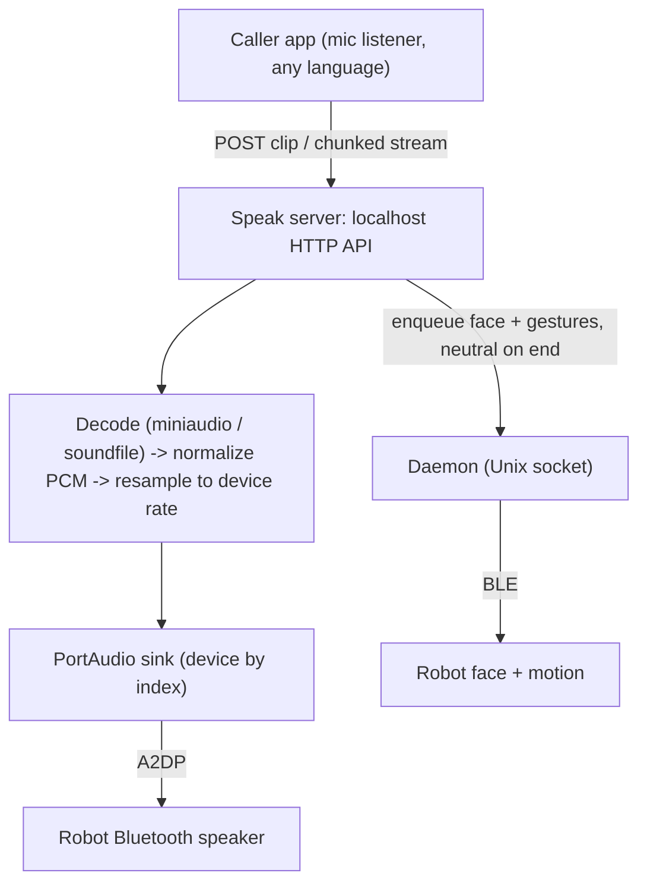

# Robot Speak Service - Plan

## Goal Capsule

- **Objective:** Add a cross-platform local service that lets any app on the machine play arbitrary audio — a finished clip or a live stream — through the robot's Bluetooth speaker specifically, without changing the host's default output, and animate the robot so it reads as talking while the audio plays.
- **Product authority:** This plan owns the output — the "speak-and-animate" side. The calling app owns input: microphone capture, wake-phrase, speech-to-text, and answer generation. That input side is not active scope.
- **De-risked (2026-08-12):** Driving the robot over BLE while host audio plays through its A2DP speaker does **not** interrupt the audio — a live test played clean host speech through the robot's Bluetooth speaker while animating it over BLE (face change plus arm gestures). The two Bluetooth connections are independent, so animate-while-speaking (R6) is safe. No blockers hold planning.

---

## Product Contract

### Summary

A cross-platform local service exposes an API that any app on the machine can call to make the robot speak. It accepts rendered audio the caller produced — a finished clip or a live stream — routes it to the robot's Bluetooth speaker without changing the host's default output, and drives the robot's LED face and motion over BLE so it reads as talking for the audio's duration.

### Problem Frame

carle can already speak through the robot with its `say:` step, but only by playing to the host's *default* audio output — so the robot's speaker has to be the system default. That fights normal use: the operator wants their own output (AirPods) to stay selected while only the robot-directed audio goes to the robot. There is also no path for a separate app — a microphone listener that captures a question and generates an answer, for example — to hand carle already-rendered audio and have the robot voice it. The gap is a targeted, app-drivable audio path to the robot, decoupled from whatever the host's default output happens to be.

### Key Decisions

- KD1. **Route arbitrary rendered audio, not text.** The service voices audio the caller produced rather than synthesizing from a string, so any voice or source works and the path is OS-independent. (session-settled: user-directed — chosen over the macOS `say -a <device>` text path: that path is macOS-and-text-only.) Governs R1.
- KD2. **Expose a cross-platform local API service.** Any app on the machine, in any language, drives it over a localhost API. (session-settled: user-directed — chosen over a Python library and over the existing CLI/MCP/daemon-socket surface: language-agnostic, and the daemon socket is POSIX-only.) Governs R3.
- KD3. **Support both a finished clip and a live stream.** Streaming's added complexity is taken on in v1, not deferred. (session-settled: user-directed — chosen over clip-only.) Governs R2.
- KD4. **Route audio and animate.** While audio plays, carle drives the robot over BLE so it reads as speaking — the payoff of routing to a robot rather than any speaker. (session-settled: user-directed — chosen over route-only.) Governs R6, R7.
- KD5. **Target the robot's speaker; never change the host default.** Playing to a chosen output device is the core mechanism, and the operator's selected output must be untouched. Governs R4, R5.
- KD6. **Design cross-platform; validate on macOS for v1.** The audio-routing and API abstractions are built cross-platform, but v1 is proven only on macOS — the operator's environment — with Windows and Linux paths landing unvalidated. (session-settled: user-directed — chosen over validating all three OSes for v1.) Governs R8.

### Actors

- A1. **Calling app** — a local application (e.g., a microphone listener) that holds rendered audio and wants the robot to voice it. Owns capture, speech-to-text, and answer generation.
- A2. **Robot Speak service (carle)** — accepts audio over the local API, routes it to the robot's speaker, and animates the robot.
- A3. **Robot (Ruko 1088)** — plays the audio through its Bluetooth speaker (A2DP sink) and animates over BLE.
- A4. **Operator** — runs both on their host and keeps their own default audio output (e.g., AirPods) selected throughout.

### Requirements

**Control-plane API**

- R1. The service accepts rendered audio from a local caller over a localhost API and voices it through the robot; it does not synthesize speech from text.
- R2. The API accepts audio both as a finished clip (a complete file or buffer) and as a live stream delivered incrementally.
- R3. Any application on the same machine, in any language, can drive the service through the API without linking carle as a library.

**Audio routing**

- R4. The service plays audio to the robot's Bluetooth speaker as an explicitly targeted output device, not the host's current default output.
- R5. The host's selected default output device is never changed by the service, and audio the operator is already hearing there is unaffected.

**Robot animation**

- R6. While audio plays, the service drives the robot over BLE so it reads as talking — a held or pulsed talking LED face plus motion for the audio's duration.
- R7. When the audio ends or is stopped, the robot returns to a neutral idle state.

**Cross-platform**

- R8. The audio-routing and API abstractions are designed for macOS, Windows, and Linux, and v1 is validated on macOS (per KD6). The BLE-animation path stays on the POSIX-only daemon for v1; making it cross-platform is deferred.

### Key Flows

- F1. Voice a finished clip.
  - **Trigger:** A1 has a complete audio answer and calls the API with the clip.
  - **Steps:** The service receives the clip, plays it to the robot's targeted speaker, starts the talking animation, and on completion returns the robot to neutral and reports done.
  - **Covers R1, R2, R4, R5, R6, R7.**
- F2. Voice a live stream.
  - **Trigger:** A1 opens a stream and pushes audio as it is generated.
  - **Steps:** The service begins playback as audio arrives, buffering as needed; the animation runs for the streamed duration; stream close ends playback and returns the robot to neutral.
  - **Covers R2, R6, R7.**

### Acceptance Examples

- AE1. **Covers R5.** Given the operator's default output is AirPods and they are listening to it, when the service voices a clip through the robot, then the AirPods audio is uninterrupted and the clip is heard only from the robot.
- AE2. **Covers R4.** Given the robot's speaker is not the host default, when the service plays audio, then the audio still reaches the robot's speaker because the device is targeted explicitly.
- AE3. **Covers R6, R7.** Given a clip is playing, when playback is underway the robot shows a talking face and moves; when playback ends the robot returns to neutral.
- AE4. **Covers R2.** Given a caller streams audio incrementally, when the first audio arrives the robot begins voicing it without waiting for the whole answer.
- AE5. **Covers R4, R5.** Given the robot's speaker is not currently a connected output device, when a caller requests playback, then the service reports the device is unavailable rather than falling back to the host default (which would leak the audio to the operator's AirPods).

### Scope Boundaries

- The input side — microphone capture, wake-phrase detection, speech-to-text, and answer generation — belongs to the calling app, not this service.
- Phoneme-accurate lip-sync is out. The robot has no mouth articulation; "talking" is an expression plus motion for the audio's duration, not word-synced movement.
- Pairing and connecting the robot as a Bluetooth audio output is host setup. The service targets an already-connected device; it does not pair one.

### Dependencies / Assumptions

- The robot's speaker is paired and connected as a host Bluetooth audio output (A2DP sink) before playback. The robot exposes `JT_Speaker`; it was not a connected output during this session because the unit was off or charging.
- The BLE animation runs through carle's control-plane daemon, which is POSIX-only today (its control channel is a Unix socket). Full cross-platform animation may require making that daemon, or the animation path, cross-platform.
- A cross-platform mechanism to play audio to a chosen output device exists; picking it is a planning decision.

### Outstanding Questions

**Deferred to Planning**

- The API transport and shape, and how clip versus stream are delivered over it.
- How the target output device is identified — name match, configured id, or discovery.
- How the animation is chosen and paced: which talking face, what motion, and how it maps to the audio's duration.
- Whether the audio service is a new process or folded into the existing daemon.

### Sources / Research

- `src/carle/daemon/engine.py:77` — the `say:` step runs macOS `say` with no device targeting, so it plays to the host default output.
- `README.md` (control-plane daemon section) — the daemon's control channel is a Unix socket, so it is POSIX-only; Windows degrades to "no daemon".
- `man say` / `say -a '?'` — macOS `say` supports `-a <device>` for device-targeted TTS; ruled out as the core mechanism because it is macOS-and-text-only.
- Hardware test (2026-08-12): host speech played to the robot's A2DP speaker stayed clean while the robot was driven over BLE (a face change plus arm gestures) — the BLE control channel and the A2DP sink do not interfere. This is what makes R6 safe, and it contrasts with the on-robot audio interrupt below, which is a different subsystem.
- Implementation gotcha (macOS): `say -a <name>` crashes on a device name (an `NSException` in the name lookup); `say -a <numeric-id>` (the id from `say -a '?'`) works. Relevant to any macOS device-targeted playback path.
- `docs/protocol-reference.md` — BLE movement frames interrupt the robot's onboard `0xB2`/`0xB3` audio; the robot exposes a `JT_Speaker` Bluetooth audio sink; Expression codes 43 and 45 read as talking faces.
- External research (2026-08-12, cross-platform per-device audio): `sounddevice`/PortAudio is the one cross-platform library that addresses an output device by index/name without touching the system default; `miniaudio` decodes MP3/compressed with no `ffmpeg` dependency and supports streaming decode; `soundfile` handles WAV/PCM. Streaming is a callback `OutputStream` fed by a bounded queue with pre-roll; a chunked HTTP request body gives backpressure via TCP flow control. Pitfalls: A2DP sinks often run at 44.1 kHz (match `default_samplerate` or resample), Bluetooth adds latency (size buffers generously), macOS identifies devices reliably by numeric id not name, Windows duplicates a device across host APIs (prefer WASAPI shared), Linux is PipeWire/WirePlumber.

---

## Planning Contract

### Product Contract preservation

Product Contract unchanged — enriched in place; all R-IDs and the session-settled Key Decisions (KD1–KD6) are preserved with their annotations.

### Key Technical Decisions

- KTD1. **Audio engine: `sounddevice`/PortAudio, addressing the robot sink by numeric index resolved once from its name.** PortAudio is the single cross-platform API (CoreAudio / WASAPI / ALSA-Pulse-PipeWire) that plays to a chosen device without changing the system default. Resolve the target device name to an index at connect time, cache the index, and re-resolve on a Bluetooth drop. Keep playback behind a small sink seam sized to what test dependency-injection needs (device query + stream factory); a per-OS CLI implementation stays a documented future fallback, not built now. Governs R4, R5, R8.
- KTD2. **Decode with `miniaudio` (MP3/compressed, no `ffmpeg`, streaming-capable) and `soundfile` (WAV/PCM); normalize everything to one internal PCM shape (float32, target device sample rate, known channel count).** Clip and stream paths share that one format. Governs R1, R2.
- KTD3. **Clip = blocking `OutputStream.write()`; stream = callback `OutputStream` fed by a bounded thread-safe queue with pre-roll buffering and underflow handling.** The bounded queue is the backpressure point. Governs R2.
- KTD4. **Transport: a localhost HTTP server — a body-upload endpoint for a finished clip and a chunked-request-body endpoint for a live stream, where TCP flow control provides backpressure.** WebSocket only if playback events must stream back. (session-settled: user-directed — instantiates KD2's local-API-service choice over a library or the CLI/MCP surface: language-agnostic, any-language callers.) Governs R1, R2, R3.
- KTD5. **Animation runs through the existing daemon.** While audio plays, the speak server enqueues a talking face (code 45) plus periodic gestures on the running daemon over its socket, and returns the robot to neutral when the audio ends. If no daemon is running, audio still plays and animation is skipped (graceful degradation). (instantiates KD4 route-audio-and-animate.) Governs R6, R7.
- KTD6. **Match the target device's sample rate.** Query the selected device's `default_samplerate` (A2DP is commonly 44.1 kHz) and resample the normalized PCM to it (with `soxr`, per KTD9) on both decode paths; size buffers generously for Bluetooth latency rather than chasing low latency. Governs R4.
- KTD7. **A new cross-platform "speak server" component, separate from the POSIX-only daemon.** It owns the audio path and the HTTP API and reaches the daemon only as a client (for animation). This keeps the cross-platform audio surface off the daemon's Unix-socket transport. (resolves the deferred service-architecture question.)
- KTD8. **The speak server is synchronous / thread-per-request, with a single playback lock.** A sync server keeps the blocking daemon client (which wraps its I/O in `asyncio.run`) safe to call, and lets the chunk reader block on the bounded queue so TCP flow control is the real backpressure (not a stalled event loop). A single playback lock serializes device access: a second speak request while one is playing returns busy (HTTP 409) rather than racing one device/stream and the shared animation state. Governs R2, R3, R6.
- KTD9. **Name the resampler and lazy-load the audio backends.** Add `soxr` to the `carle[speak]` extra and resample the normalized PCM to the device rate on both the WAV and compressed paths (soundfile/sounddevice do not resample). Import `sounddevice`/`soundfile`/`miniaudio`/`soxr` lazily inside the sink, decode, and stream factories so the modules import — and the test suite collects — without the extra and on a headless CI runner. Governs R4, R8.

### High-Level Technical Design

For the stream path, decoded PCM blocks flow: producer (HTTP chunk reader) → bounded queue → PortAudio callback → device. A full queue stops the socket read, so TCP pushes back on the caller.

### Assumptions

- The daemon is running and holds the BLE link when animation is wanted (v1 on macOS). Absent daemon → audio plays, animation skipped.
- The robot's speaker is paired and connected as an OS audio output before playback (host setup, per Scope Boundaries).
- v1 is validated on macOS; Windows and Linux are designed-for but unvalidated (KD6).
- BLE animation does not interrupt the A2DP audio — validated on hardware 2026-08-12 (Goal Capsule).

### Sequencing

U1 → U2 → U3 build the audio core. U4 (HTTP API) depends on U1–U3. U5 (animation) depends only on the daemon client and can proceed in parallel with the audio core. U6 (CLI wiring) depends on U4 and U5. U7 (deps and docs) runs alongside from the start.

---

## Implementation Units

### U1. Device-targeted PortAudio sink

- **Goal:** Play a decoded PCM buffer to a specific output device, leaving the host default untouched.
- **Requirements:** R4, R5, R8.
- **Dependencies:** none.
- **Files:** `src/carle/speak/__init__.py`, `src/carle/speak/sink.py`, `tests/test_speak_sink.py`.
- **Approach:**
  - Enumerate output devices (`sounddevice.query_devices`, filter `max_output_channels > 0`); resolve the configured target name to a numeric index once and cache it (per KTD1).
  - Define an `AudioSink` interface with a PortAudio implementation; play a clip via a blocking `OutputStream.write()` (per KTD3). Never mutate `sounddevice.default.device`.
  - Re-resolve the index on a device-not-found / stream error (Bluetooth reconnect).
- **Patterns to follow:** the injected-dependency style of `Engine` in `src/carle/daemon/engine.py` (inject the device-query and stream factory so tests use fakes).
- **Test scenarios:**
  - Resolves a target device name to the matching index; picks the output (not an input) device.
  - Plays a buffer through the injected fake stream to the resolved index; the system default is never set.
  - Target name not found → raises a clear "device unavailable" error (Covers AE5).
  - Stream error mid-play → re-resolves the index and surfaces the failure if it still can't find the device.
- **Verification:** unit tests pass against a fake PortAudio; no call sets the default device.

### U2. Audio decoding and normalization

- **Goal:** Turn caller audio (WAV or compressed) into one internal PCM shape at the device sample rate.
- **Requirements:** R1, R2.
- **Dependencies:** U1.
- **Files:** `src/carle/speak/decode.py`, `tests/test_speak_decode.py`.
- **Approach:**
  - Whole-clip: decode WAV/PCM with `soundfile`, MP3/compressed with `miniaudio`; sniff the container or accept a declared `samplerate`/`channels`/`dtype` for raw PCM.
  - Live compressed stream: expose `miniaudio`'s streaming decoder so the U3 chunk reader can feed compressed bytes in and get PCM blocks out incrementally — do not require the whole buffer.
  - Normalize to float32 at a known channel count (up/down-mix mono↔stereo to match the sink); resample to the device `default_samplerate` with `soxr` (per KTD6, KTD9) on both paths.
  - Import the audio backends lazily inside the decode functions so the module imports without the `carle[speak]` extra (KTD9).
- **Patterns to follow:** small pure functions returning NumPy buffers, mirrored by fixture files under `tests/`.
- **Test scenarios:**
  - Decodes a small WAV fixture to float32 at the expected sample rate and channels.
  - Decodes a small MP3 fixture without any external binary present.
  - Incrementally decodes a chunked MP3 stream to PCM blocks as bytes arrive, not whole-buffer.
  - Resamples a 48 kHz buffer to a 44.1 kHz target device rate via `soxr` (Covers R4).
  - Mono source to a stereo sink is up-mixed (not silent/half-volume on one channel).
  - Raw-PCM input with declared format is accepted and normalized.
  - Unsupported/garbage bytes → a clear decode error, not a crash.
- **Verification:** decode tests pass with no `ffmpeg` on PATH; the module imports without the `speak` extra.

### U3. Streaming playback

- **Goal:** Play a live, incrementally-delivered stream to the device in real time.
- **Requirements:** R2, R7.
- **Dependencies:** U1, U2.
- **Files:** `src/carle/speak/stream.py`, `tests/test_speak_stream.py`.
- **Approach:**
  - Callback `OutputStream` fed by a bounded `queue.Queue` of fixed-size PCM blocks; pre-roll a few blocks before starting; on underflow, write silence and record the `output_underflow` status (per KTD3).
  - A full queue is the backpressure signal for the producer; a stop/flush path drains and closes cleanly.
  - **Completion is device-drain, not source-drain:** stop only after the stream's buffered frames have flushed (per KTD6's generous Bluetooth buffers), and emit a single terminal signal — `completed` or `died` — that the animation coordinator (U5) waits on.
  - **Device loss mid-stream:** a callback error (Bluetooth drop) surfaces, tears down the stream, and emits the `died` signal; re-resolving an index does not revive an in-flight callback stream, so the caller must re-open.
  - Import the backend lazily inside the stream factory (KTD9).
- **Patterns to follow:** the spawn/await lifecycle model in `src/carle/daemon/engine.py` for start/stop semantics.
- **Test scenarios:**
  - Enqueued blocks are played in order through the fake callback stream.
  - Empty queue at callback time → silence written, underflow recorded, no crash.
  - Producer outpaces playback → the bounded queue blocks the producer (backpressure).
  - Stop mid-stream drains and closes; the terminal signal is emitted (Covers R7).
  - The terminal `completed` signal fires only after buffered frames flush (device-drain), not when the source queue empties.
  - Device disappears mid-stream → stream torn down, `died` signal emitted (Covers R7).
- **Verification:** streaming tests pass; no unbounded memory growth under a fast producer; the module imports without the `speak` extra.

### U4. Local HTTP API server

- **Goal:** Accept a clip or a stream from any local app and drive playback.
- **Requirements:** R1, R2, R3.
- **Dependencies:** U1, U2, U3.
- **Files:** `src/carle/speak/server.py`, `tests/test_speak_server.py`.
- **Approach:**
  - A **synchronous / thread-per-request** localhost HTTP server (per KTD8): a clip endpoint (request body = audio bytes, plus target device and format fields), a stream endpoint (chunked request body read incrementally into the stream queue), and a **stop/cancel endpoint** that interrupts the in-flight clip or stream and returns the robot to neutral.
  - **Single playback lock (KTD8):** hold the device for one playback at a time; a second clip/stream request while one is active returns HTTP 409/busy — never two playbacks on one device or a raced animation state.
  - Resolve the target device server-side to a PortAudio index; return a clear error when it is unavailable (Covers AE5). Bind to loopback only.
- **Patterns to follow:** the newline-delimited-JSON request/response discipline and error envelope in `src/carle/daemon/protocol.py` and `server.py`.
- **Test scenarios:**
  - POST a clip → it decodes and plays through the fake sink; response reports success.
  - Stream endpoint reads chunks incrementally and feeds the stream queue (Covers AE4).
  - A second speak request during active playback returns 409/busy, not corrupted audio.
  - Stop endpoint interrupts an in-flight clip and returns the robot to neutral (Covers R7).
  - Target device unavailable → error response, no fallback to the default device (Covers AE2, AE5).
  - Bind is loopback-only; a non-audio/garbage body → 4xx, not a crash.
- **Verification:** server tests pass against fake sink/stream; endpoints reachable on loopback; overlapping requests are serialized.

### U5. Animation coordination

- **Goal:** Make the robot read as talking while audio plays, and neutral when it ends.
- **Requirements:** R6, R7.
- **Dependencies:** the daemon client (`src/carle/daemon/client.py`); independent of U1–U4.
- **Files:** `src/carle/speak/animate.py`, `tests/test_speak_animate.py`.
- **Approach:**
  - On playback start, enqueue a talking face (code 45); drive gestures on an **interval timer** for the playback duration via the daemon client (safe to call from the sync server thread, per KTD8).
  - Stop the timer and enqueue a neutral return on the audio layer's terminal signal — whether `completed` (device drained, U3) or `died` (device loss). A **watchdog timeout** also returns to neutral so a stalled/silent-but-open stream never leaves the talking face held indefinitely.
  - If no daemon is reachable, log and skip animation — audio is unaffected (graceful degradation).
- **Patterns to follow:** `src/carle/daemon/client.py` request shape; face/gesture item shapes in `src/carle/daemon/protocol.py`.
- **Test scenarios:**
  - Playback start enqueues a talking face and the gesture timer emits at least one gesture through the fake daemon client (Covers R6).
  - The `completed` signal stops the timer and enqueues a neutral return (Covers R7).
  - A `died` signal (device loss) returns the robot to neutral (Covers R7).
  - A stalled stream (no terminal signal) returns to neutral within the watchdog timeout rather than holding the talking face.
  - No daemon reachable → animation is skipped and playback still proceeds (graceful degradation).
- **Verification:** animation tests pass against a fake daemon client; absence of the daemon never fails playback; no path leaves the talking face held forever.

### U6. CLI entry point and wiring

- **Goal:** One command starts the speak server wired to the sink, streaming, API, and animation.
- **Requirements:** R1, R3, R6.
- **Dependencies:** U4, U5.
- **Files:** `src/carle/cli.py` (new `speak-server` subcommand), `src/carle/speak/service.py`, `tests/test_cli_speak.py`.
- **Approach:**
  - Add a `carle speak-server` subcommand taking the target output-device name (default the robot's `JT_Speaker`) and the daemon socket path for animation; compose sink + decode + stream + server + animate.
  - Degrade cleanly on platforms without the audio deps installed (clear message), mirroring the daemon's off-POSIX degradation.
- **Patterns to follow:** existing subcommand registration and `main(...)` seam in `src/carle/cli.py`.
- **Test scenarios:**
  - `carle speak-server` parses the device and socket args and constructs the service with fakes.
  - Missing audio dependency → a clear "install carle[speak]" message, not a traceback.
  - Covers F1 and F2 end-to-end against fakes (clip and stream both reach the sink and trigger animation).
- **Verification:** CLI tests pass; the subcommand appears in help.

### U7. Dependencies and documentation

- **Goal:** Declare the new audio dependencies and document the feature.
- **Requirements:** R8.
- **Dependencies:** none (runs alongside).
- **Files:** `pyproject.toml`, `README.md`, `docs/movement-vocabulary.md` (or a new `docs/speak.md`).
- **Approach:**
  - Add `sounddevice`, `soundfile`, `miniaudio`, `soxr` as an optional extra `carle[speak]` (mirrors `carle[mcp]`), so the core CLI stays lean.
  - Document the flow: pair the robot as a Bluetooth output, run `carle daemon start` (for animation) and `carle speak-server`, and POST audio; note the macOS-validated / cross-platform-designed status and the system-default-untouched guarantee.
- **Patterns to follow:** the `carle[mcp]` optional-extra pattern in `pyproject.toml`; README's daemon section.
- **Test scenarios:** Test expectation: none — packaging and docs. A smoke check that `carle` imports without the `speak` extra installed belongs in U6.
- **Verification:** `uv sync` resolves the extra; docs render; core install unaffected.

---

## Verification Contract

| Gate | Command / signal | Applies to |
|---|---|---|
| Unit tests | `uv run pytest` with `carle[speak]` and the system PortAudio library installed; device, stream, and daemon are faked/mocked, and the speak modules import their backends lazily so collection never fails on a lean/headless runner | U1–U6 |
| Lint / format | `uv run ruff check` and `uv run ruff format --check` | all |
| Core install unaffected | `carle` CLI imports and runs without the `speak` extra | U6, U7 |
| Hardware smoke (macOS, manual) | With the robot paired as an audio output and the daemon running: POST a WAV clip and an MP3 stream; the robot's speaker plays them, the robot animates and returns to neutral only after playback truly finishes, and the host default output (AirPods) is untouched | F1, F2, R4–R7 |

CI installs `carle[speak]` plus system PortAudio (`libportaudio`) so the speak tests run; because the backends load lazily (KTD9), a lean/headless collection still imports cleanly. The BLE-vs-A2DP interaction is already validated on hardware (Goal Capsule), so the smoke test confirms integration, not that de-risk.

---

## Definition of Done

- Units U1–U7 complete; requirements R1–R8 satisfied.
- `uv run pytest` green; `ruff` clean; core CLI unaffected without the `speak` extra.
- On macOS: a clip and a live stream both play through the robot's Bluetooth speaker via the HTTP API, the robot animates while speaking and returns to neutral, and the host's default output is never changed.
- An unavailable target device fails loudly rather than leaking audio to the default output (AE5).
- README/docs describe setup and the cross-platform-designed / macOS-validated status.
